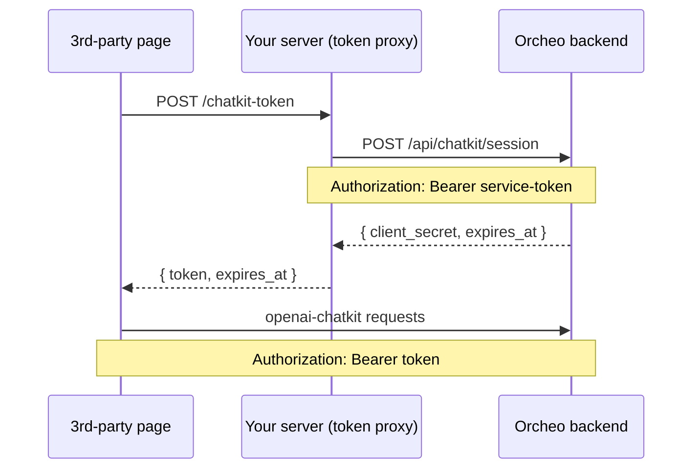

# ChatKit Embedding Guide

Learn how to drop the ChatKit bubble into any static HTML page and connect it to
Orcheo's published workflows. Use this guide in tandem with the demo at
`examples/chatkit-orcheo.html`, which ships a working implementation you can
copy/paste or customize.

## When to use this guide
- You have a workflow that is already published via `orcheo workflow publish`
  (with or without the `--require-login` flag).
- You want to embed a floating chat bubble in a marketing site, docs page, or
  prototype without pulling in the full Canvas frontend.
- You can point the page at an Orcheo backend that exposes `/api/chatkit` to the
  public internet. The backend may live on localhost for testing; the browser
  must be able to reach it directly.

## Prerequisites
1. **Published workflow** – run `orcheo workflow publish <workflow_id>` and grab
   the share URL (e.g. `https://canvas.example/chat/wf_123`).
2. **Backend URL** – the base `http(s)` origin where your Orcheo FastAPI server
  is running. The ChatKit JS client hits `${backend}/api/chatkit` for every
  message. Serve the HTML page itself via `http://` or `https://`; ChatKit iframes
  cannot initialize from a `file://` origin.
3. **Domain key** – set `window.ORCHEO_CHATKIT_DOMAIN_KEY` or configure
   `VITE_ORCHEO_CHATKIT_DOMAIN_KEY` if you are bundling assets. Local builds can
   default to `domain_pk_localhost_dev`.
4. **Optional cookies** – when `--require-login` is enabled, the page must be
   served from the same origin (or a domain that already carries the OAuth
   session cookies) so ChatKit can forward them via `credentials: "include"`.

## Embedding steps
1. **Load the ChatKit bundle**
   ```html
   <script
     async
     src="https://orcheo.ai-colleagues.com/api/chatkit/assets/chatkit.js"
     crossorigin="anonymous"
   ></script>
   ```
   Orcheo proxies ChatKit assets to the upstream CDN. The server must be able
   to reach `https://cdn.platform.openai.com`; override with
   `ORCHEO_CHATKIT_CDN_BASE_URL` if needed.
2. **Add a launcher + container** – place a floating button and a hidden panel
   that contains `<openai-chatkit>`. See `examples/chatkit-orcheo.html` for a
   fully styled version that mirrors the Canvas chat bubble UX.
3. **Capture configuration** – collect:
   - Backend base URL (`http://localhost:8000` for local dev)
   - Workflow share URL or ID (we parse either)
   - Optional display name for the bubble header
4. **Inject ChatKit options** – call `chatkit.setOptions({ ... })` once the
   widget is defined. Use the helper below to ensure every request carries the
   required `workflow_id` metadata for published workflows.
   ```js
   const fetchWithWorkflow = ({ workflowId, workflowName, backendBase }) => {
     const baseFetch = window.fetch.bind(window);
     const apiUrl = `${backendBase}/api/chatkit`;

     return async (input, init = {}) => {
       const requestInfo = input || apiUrl;
       const nextInit = { ...init, credentials: "include" };
       const headers = new Headers(nextInit.headers || {});
       const isJsonBody =
         typeof nextInit.body === "string" ||
         (headers.get("Content-Type") || "").includes("application/json");

       const serialize = (original) => {
         if (!original) {
           return JSON.stringify({
             workflow_id: workflowId,
             metadata: { workflow_name: workflowName, workflow_id: workflowId },
           });
         }
         const payload = JSON.parse(original);
         payload.workflow_id ||= workflowId;
         payload.metadata = {
           ...(payload.metadata || {}),
           workflow_name: workflowName,
           workflow_id: workflowId,
         };
         return JSON.stringify(payload);
       };

       if (isJsonBody || !nextInit.body) {
         const serialized = typeof nextInit.body === "string" ? nextInit.body : null;
         nextInit.body = serialize(serialized);
         headers.set("Content-Type", "application/json");
       }

       nextInit.headers = headers;
       const response = await baseFetch(requestInfo, nextInit);
       if (!response.ok) {
         console.error("ChatKit request failed", await response.clone().text());
       }
       return response;
     };
   };
   ```
5. **Wire up the bubble** – toggle the panel with CSS transitions, and block the
   send button until a workflow is configured. The example page polls the shadow
   DOM every ~800 ms to keep the composer disabled when needed.
6. **Persist selection (optional)** – storing the backend URL and workflow ID in
   `sessionStorage` lets users refresh without re-entering data.

## Sample snippet
```html
<openai-chatkit></openai-chatkit>
<script>
  const chatkit = document.querySelector("openai-chatkit");
  function configureChat(options) {
    const assign = () => chatkit.setOptions(options);
    if (customElements.get("openai-chatkit")) {
      assign();
    } else {
      customElements.whenDefined("openai-chatkit").then(assign);
    }
  }

  const workflowId = "wf_123";
  const workflowName = "Support Assistant";
  const backendBase = "https://api.example";

  configureChat({
    api: {
      url: `${backendBase}/api/chatkit`,
      domainKey: window.ORCHEO_CHATKIT_DOMAIN_KEY,
      fetch: fetchWithWorkflow({ workflowId, workflowName, backendBase }),
    },
    header: { enabled: true, title: { text: workflowName } },
    history: { enabled: true },
    composer: { placeholder: `Ask ${workflowName} a question…` },
  });
</script>
```

## Troubleshooting checklist
- **403 or 404 responses** – confirm the workflow is still published and that the
  workflow ID matches the final segment of the share URL.
- **401 responses** – required when `--require-login` is set. Make sure the page
  is served from the same origin as Canvas so OAuth cookies are available.
- **CORS failures** – `/api/chatkit` must allow the host running your HTML page.
  Set `ORCHEO_CORS_ALLOW_ORIGINS` (see `docs/environment_variables.md`) to a JSON
  list of allowed origins such as
  ``export ORCHEO_CORS_ALLOW_ORIGINS='["http://localhost:8080","http://127.0.0.1:5173"]'``.
  Include every scheme/host/port that will load the embedded page.
- **Domain key errors** – supply a valid `ORCHEO_CHATKIT_DOMAIN_KEY` value. Use
  different keys per environment when possible.
- **Bubble never opens** – check the console for errors and verify the page
  called `chatkit.setOptions` after the custom element loaded.

## Embedding on a Third-Party Website with JWT Tokens

The steps above work for **public** (published) workflows where no login is required.
If you want to embed ChatKit on an external website while keeping the workflow private
— or when the 3rd-party site cannot share cookies with your Canvas origin — use
**short-lived session JWTs** instead.  The pattern is:



### Step 1 — Create a service token with `chatkit:session` scope

Orcheo's `POST /api/chatkit/session` endpoint requires the caller to hold the
`chatkit:session` scope.  Create a dedicated service token for your embedding
proxy:

```bash
# Point the CLI at your Orcheo backend
export ORCHEO_API_URL="https://orcheo.example.com"
export ORCHEO_SERVICE_TOKEN="<your-admin-or-bootstrap-token>"

orcheo token create \
  --id chatkit-embed-proxy \
  --scope chatkit:session
```

> **Token is shown only once.** Copy the secret immediately and store it in your
> secret manager (AWS Secrets Manager, Vault, 1Password, etc.).  The token only
> needs the `chatkit:session` scope — no broader access is required.

Verify the token was created:

```bash
orcheo token list
# ID                  SCOPES             STATUS
# chatkit-embed-proxy chatkit:session    active
```

To rotate the token later (e.g. on a 90-day schedule):

```bash
orcheo token rotate chatkit-embed-proxy --overlap 600
```

### Step 2 — Serve a token-vending endpoint from your server

Your server-side proxy exchanges the service token for a short-lived ChatKit JWT
(`client_secret`).  **Never expose the service token to the browser.**

=== "Python (FastAPI)"

    ```python
    import httpx
    from fastapi import FastAPI
    from fastapi.middleware.cors import CORSMiddleware

    app = FastAPI()

    # Allow only the domains that host the embedded widget
    app.add_middleware(
        CORSMiddleware,
        allow_origins=["https://your-website.example.com"],
        allow_methods=["POST"],
    )

    ORCHEO_BACKEND = "https://orcheo.example.com"
    ORCHEO_SERVICE_TOKEN = "your-chatkit-embed-proxy-secret"  # from env in practice

    @app.post("/chatkit-token")
    async def get_chatkit_token(workflow_id: str):
        async with httpx.AsyncClient() as client:
            resp = await client.post(
                f"{ORCHEO_BACKEND}/api/chatkit/session",
                headers={"Authorization": f"Bearer {ORCHEO_SERVICE_TOKEN}"},
                json={"workflow_id": workflow_id},
            )
            resp.raise_for_status()
            return resp.json()  # { "client_secret": "...", "expires_at": "..." }
    ```

=== "JavaScript (Express)"

    ```js
    import express from "express";
    import cors from "cors";

    const app = express();

    const ORCHEO_BACKEND = "https://orcheo.example.com";
    const ORCHEO_SERVICE_TOKEN = process.env.ORCHEO_SERVICE_TOKEN;

    // Allow only the domains that host the embedded widget
    app.use(cors({ origin: "https://your-website.example.com", methods: ["POST"] }));
    app.use(express.json());

    app.post("/chatkit-token", async (req, res) => {
      const { workflow_id } = req.query;
      const response = await fetch(`${ORCHEO_BACKEND}/api/chatkit/session`, {
        method: "POST",
        headers: {
          "Authorization": `Bearer ${ORCHEO_SERVICE_TOKEN}`,
          "Content-Type": "application/json",
        },
        body: JSON.stringify({ workflow_id }),
      });
      if (!response.ok) {
        return res.status(response.status).json(await response.json());
      }
      res.json(await response.json()); // { client_secret, expires_at }
    });

    app.listen(3000);
    ```

The `client_secret` JWT has a short TTL (default 300 s, tunable via
`CHATKIT_TOKEN_TTL_SECONDS` on the Orcheo backend).  The embed refreshes it
automatically before it expires.

### Step 3 — Embed the widget with JWT authentication

Add the same `<openai-chatkit>` web component as for public embeds, but inject
an `Authorization: Bearer` header via the custom `fetch` wrapper.  The token
is transparently refreshed before each near-expiry request.

```html
<!-- 1. Load the ChatKit bundle -->
<script
  async
  src="https://orcheo.example.com/api/chatkit/assets/chatkit.js"
  crossorigin="anonymous"
></script>

<!-- 2. Widget container -->
<openai-chatkit></openai-chatkit>

<script type="module">
  const WORKFLOW_ID  = "wf_your_workflow_id";
  const BACKEND      = "https://orcheo.example.com";
  const TOKEN_URL    = "https://your-server.example.com/chatkit-token";
  const DOMAIN_KEY   = window.ORCHEO_CHATKIT_DOMAIN_KEY || "domain_pk_localhost_dev";

  // --- Token management ---
  let session = { token: null, expiresAt: new Date(0) };

  async function refreshToken() {
    const res = await fetch(`${TOKEN_URL}?workflow_id=${WORKFLOW_ID}`, {
      method: "POST",
    });
    if (!res.ok) throw new Error(`Token fetch failed: ${res.status}`);
    const { client_secret, expires_at } = await res.json();
    session = { token: client_secret, expiresAt: new Date(expires_at) };
  }

  async function getToken() {
    // Refresh if within 30 s of expiry
    if (Date.now() > session.expiresAt - 30_000) {
      await refreshToken();
    }
    return session.token;
  }

  // --- Custom fetch that injects Authorization + workflow_id ---
  const fetchWithJwt = async (input, init = {}) => {
    const token   = await getToken();
    const headers = new Headers(init.headers || {});
    headers.set("Authorization", `Bearer ${token}`);

    // Inject workflow_id into the request body
    const bodyStr = typeof init.body === "string" ? init.body : null;
    const body    = bodyStr ? JSON.parse(bodyStr) : {};
    body.workflow_id ??= WORKFLOW_ID;
    headers.set("Content-Type", "application/json");

    return fetch(input ?? `${BACKEND}/api/chatkit`, {
      ...init,
      headers,
      body: JSON.stringify(body),
    });
  };

  // --- Wire up the widget ---
  const chatkit = document.querySelector("openai-chatkit");

  const configure = () =>
    chatkit.setOptions({
      api: {
        url: `${BACKEND}/api/chatkit`,
        domainKey: DOMAIN_KEY,
        fetch: fetchWithJwt,
      },
      header:   { enabled: true, title: { text: "Support Assistant" } },
      history:  { enabled: true },
      composer: { placeholder: "Ask a question…" },
    });

  if (customElements.get("openai-chatkit")) {
    configure();
  } else {
    customElements.whenDefined("openai-chatkit").then(configure);
  }
</script>
```

### Differences from the public embed

| | Public embed | JWT embed |
|---|---|---|
| Workflow visibility | `is_public = true` required | Private workflows supported |
| Auth mechanism | Cookies (`credentials: "include"`) | `Authorization: Bearer <token>` |
| Session source | None | `POST /api/chatkit/session` via your proxy |
| Service token scope needed | None | `chatkit:session` |
| Token TTL | N/A | 300 s default; auto-refreshed by the widget |

### Troubleshooting JWT embeds

- **401 on `/api/chatkit/session`** – confirm your service token has the
  `chatkit:session` scope (`orcheo token show chatkit-embed-proxy`).
- **401 on `/api/chatkit`** – the `client_secret` JWT may have expired without
  being refreshed; check the 30-second refresh window in `getToken()`.
- **CORS errors on your token proxy** – add the 3rd-party origin to
  `allow_origins` in your proxy server and to `ORCHEO_CORS_ALLOW_ORIGINS` on
  the Orcheo backend.
- **`CHATKIT_TOKEN_SIGNING_KEY` not set** – the session endpoint returns 500
  if this key is missing; see `docs/environment_variables.md`.

## References
- Working demo: `examples/chatkit-orcheo.html`
- Backend contract: `apps/backend/src/orcheo_backend/app/routers/chatkit.py`
- Canvas embedding code: `apps/canvas/src/features/chatkit/components/public-chat-widget.tsx`
- Authentication guide: `docs/authentication_guide.md`
