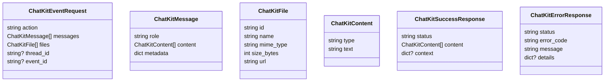

# ChatKit Integration Design

## 1. Summary
- **Purpose**: Define the plan for connecting OpenAI ChatKit to Orcheo so conversations trigger backend workflows with persisted chat state.
- **Scope**: Frontend wiring in `examples/chatkit-orcheo.html`, a new ChatKit webhook endpoint inside the Orcheo FastAPI app, orchestration of ChatKit actions into Orcheo workflows via LangGraph, and SQLite-backed storage for conversation artifacts.
- **Status**: Draft for implementation; no code changes committed yet.

## 2. Objectives & Success Criteria
| Objective | Success Criteria |
| --- | --- |
| ChatKit actions call Orcheo | Actions initiated in the widget result in HTTP requests to an Orcheo endpoint with workflow context, returning structured responses that ChatKit renders. |
| Workflow selection | The HTML example lets operators choose an Orcheo workflow (pre-registered or demo) before starting the session; selection persists for the session. |
| Backend orchestration | The new endpoint validates payloads, resolves the selected workflow, and invokes a LangGraph-powered execution stub. |
| Data persistence | Chat messages, threads, and file metadata persist to SQLite with migration + cleanup utilities. |
| Extensibility | Design supports swapping the scripted LangGraph stub with real orchestrations without altering ChatKit contract. |

## 3. Functional Requirements
1. **ChatKit example wiring**
   - Embed ChatKit per OpenAI guidance with custom `actions`, `theme`, and `onSubmit` handlers.
   - Provide a workflow dropdown (populated from a static list or fetched via `/api/workflows`) and disable the chat input until a workflow is selected.
   - Forward ChatKit action payloads to `/api/chatkit/sessions/{session_id}/events` with headers for session + workflow.
2. **Backend endpoint**
   - Implement `POST /api/chatkit/sessions/{session_id}/events` in FastAPI.
   - Authenticate requests with Orcheo API keys (header: `X-Orcheo-Api-Key`) validated via the existing credential service, falling back to signed session cookies for console-driven usage.
   - Validate ChatKit signature (HMAC SHA-256 using shared secret), enforce workflow selection, persist inbound payloads, and dispatch to LangGraph.
   - Return ChatKit-compatible responses using the response schema defined in §3.1.
3. **LangGraph stub workflow**
   - Create `examples/langgraph/chatkit_demo.py` (name TBD) that builds a vanilla LangGraph similar to `examples/vanilla_langgraph.py`.
   - Provide scripted deterministic nodes (e.g., greeting, workflow summary, fallback) to emulate responses until real workflows exist.
   - Expose helper to run graph synchronously from backend.
4. **SQLite storage**
   - Add SQLite DB (e.g., `data/chatkit.sqlite3`) with tables: `sessions`, `threads`, `messages`, `files`.
   - Provide data access layer with migrations, connection pooling, and TTL/archival utilities.
   - Ensure backend endpoint reads/writes via DAL before invoking LangGraph.

### 3.1 API Contract



- **Request model** (`ChatKitEventRequest`): Received in the POST body. `messages` and `files` mirror ChatKit payloads; `event_id` is used for idempotency. Validated via Pydantic models in `orcheo.chatkit.schema`.
- **Success response** (`ChatKitSuccessResponse`):
  ```json
  {
    "status": "completed",
    "content": [
      {"type": "output_text", "text": "Workflow <workflow_id> acknowledged."}
    ],
    "context": {"workflow_id": "demo-support"}
  }
  ```
- **Error response** (`ChatKitErrorResponse`):
  ```json
  {
    "status": "failed",
    "error_code": "auth_failed",
    "message": "Invalid Orcheo API key provided.",
    "details": {"request_id": "abc123"}
  }
  ```
- **HTTP status codes**: 200 for success, 400 for validation, 401 for auth/signature failure, 409 for duplicate `event_id`, 429 for rate limiting, 500 for unexpected errors with safe messaging.

### 3.2 Error Handling & Retries

- **Validation errors**: Return `400` with `error_code="validation_failed"` and include a structured `details` map listing invalid fields.
- **Authentication/signature errors**: Return `401` with `error_code="auth_failed"`; response body omits sensitive hints and includes `request_id` for traceability.
- **Rate limits**: Return `429` with `error_code="rate_limited"`, `Retry-After` header, and record metric `chatkit.rate_limited_total`.
- **LangGraph timeouts**: Cancel graph execution after 20 seconds, return `503` with `error_code="workflow_timeout"`, and persist timeout event for replay.
- **Unexpected errors**: Return `500` with `error_code="internal_error"`; log structured error with correlation IDs and enqueue alert for observability stack.
- **Idempotency**: Duplicate `event_id` results return `409` with `error_code="event_already_processed"` and last response payload to support ChatKit retries.

## 4. Non-Functional Requirements
- **Security**: Support signature verification, workflow access checks, per-session rate limiting (default 60 events/min), and configurable throttles per workflow.
- **Observability**: Log ChatKit events, track workflow execution metadata, and emit metrics (count per action, failure rates) via the existing `orcheo.telemetry` Prometheus exporter. Emit structured logs (`chatkit.event`, `chatkit.error`) and expose `/api/chatkit/health` returning DB connectivity + signature config status.
- **Reliability**: Handle retries/idempotency with `event_id` tracking, ensure database transactions wrap each request, and enforce a LangGraph execution timeout (default 20s) with graceful cancellation + retry guidance.
- **Maintainability**: Encapsulate ChatKit logic in dedicated module `orcheo.chatkit` with tests and documentation.
- **Performance**: P95 backend response time under 2 seconds for stub workflow with <20 messages, hard timeout of 25 seconds, maximum file upload size of 15 MB per attachment.

## 5. Architectural Overview
### 5.1 Component Diagram
```
ChatKit Widget (examples/chatkit-orcheo.html)
  └── fetch() -> Orcheo FastAPI (/api/chatkit/...)
          ├── ChatKitService (validation + persistence)
          ├── ChatStore (SQLite DAL)
          └── LangGraphRunner (executes chat workflow)
LangGraph Graph (examples/langgraph/chatkit_demo.py)
  └── scripted nodes -> response payloads
```

### 5.2 Request Flow
1. User selects workflow in the HTML dropdown; widget stores `workflow_id` in `sessionStorage`.
2. ChatKit action fires `onSubmit` → `fetch('/api/chatkit/...', { body: { action, messages, files } })` with headers for `X-Orcheo-Workflow-ID`, `X-ChatKit-Session`, and `X-Orcheo-Api-Key` (if API key auth is used).
3. FastAPI endpoint:
   - Authenticates request (API key or session cookie), validates ChatKit signature, validates JSON schema, logs event, and enforces per-session rate limits.
   - Upserts session/thread, persists messages/files to SQLite.
   - Calls `LangGraphRunner.run(workflow_id, payload)` with a 20s timeout and maps results to standardized responses/errors.
4. `LangGraphRunner` loads configured LangGraph (scripted) or uses Orcheo workflow registry.
5. Response mapped to ChatKit format and returned to widget for rendering.

### 5.3 Module Placement
- `src/orcheo/chatkit/router.py`: FastAPI router + dependency wiring.
- `src/orcheo/chatkit/service.py`: Business logic (validation, persistence, orchestration).
- `src/orcheo/chatkit/store.py`: SQLite DAL using `sqlite3` with `LifoQueue` connection pool and WAL mode helpers.
- `examples/chatkit-orcheo.html`: Frontend integration + UX tweaks.
- `examples/langgraph/chatkit_demo.py`: LangGraph stub for ChatKit.
- `tests/chatkit/`: Unit/integration tests for DAL, service, endpoint, and HTML snapshot if needed.

## 6. Data Model
| Table | Columns | Notes |
| --- | --- | --- |
| `sessions` | `id (PK)`, `workflow_id`, `created_at`, `updated_at`, `status` | Tracks ChatKit sessions and associated workflow. |
| `threads` | `id (PK)`, `session_id (FK)`, `chatkit_thread_id`, `created_at`, `updated_at` | Allows multi-thread or parallel conversations. |
| `messages` | `id (PK)`, `thread_id (FK)`, `direction (enum:user,assistant,system)`, `content (JSON)`, `metadata (JSON)`, `event_id`, `created_at` | Persists content + deduplicates via `event_id`. |
| `files` | `id (PK)`, `message_id (FK)`, `file_name`, `mime_type`, `url`, `size_bytes`, `created_at` | Metadata only; storage delegated to existing blob service when available. |

- Implement migrations by reusing the SQLite bootstrap pattern from `orcheo.vault.FileCredentialVault`: create `src/orcheo/chatkit/migrations.py` with idempotent DDL revisions and invoke it during application startup + via `uv run orcheo-dev-server -- --chatkit-migrate` helper.
- Provide `ChatStore` methods: `create_session`, `update_session_workflow`, `add_message`, `attach_files`, `get_thread_history`, `mark_event_processed`.

## 7. LangGraph Demo Workflow
- Node graph: `InputNode` → `WorkflowSummaryNode` → `ClosingNode`.
- Each node returns scripted text referencing the chosen workflow and any user attachments.
- Provide `def build_chatkit_demo_graph(): ...` returning `Graph` plus `run_graph(messages: list[Message]) -> list[Message]` helper.
- Document how to replace with real Orcheo workflows (load by workflow_id, use orchestrator service).

## 8. Implementation Plan
1. **Scaffold backend module**
   - Add router/service/store skeletons, configure FastAPI include.
   - Create SQLite DB initialization (config-driven path, ensure directories exist) and enable WAL mode + foreign keys during startup hook.
2. **Implement DAL**
   - Define schema migrations, implement `LifoQueue`-backed connection pooling (mirroring `orcheo.vault.FileCredentialVault`), CRUD helpers, tests.
3. **Service logic**
   - Validate ChatKit payload (use Pydantic models), orchestrate persistence + LangGraph call, map responses, and surface standardized error contracts.
4. **LangGraph stub**
   - Build sample graph + runner, ensure importable by service.
   - Provide CLI/test harness (optional) for manual verification.
5. **Frontend wiring**
   - Update HTML example with workflow selector, event handling, error states, theming.
6. **Documentation + tests**
   - Add README section for ChatKit usage, update docs to link design.
   - Create unit/integration tests; add manual test checklist.

## 9. Monitoring & Operations
- **Metrics**: Expose Prometheus counters/gauges via `orcheo.telemetry`:
  - `chatkit.events_total{status="success|failed"}`
  - `chatkit.latency_seconds` (histogram aligned with global latency buckets)
  - `chatkit.rate_limited_total`
  - `chatkit.timeout_total`
- **Logging**: Emit structured JSON logs with `event_type`, `session_id`, `workflow_id`, and `request_id`; errors include `error_code` and stack traces. Logs feed into existing ELK pipeline via FastAPI logger configuration.
- **Tracing**: Wrap LangGraph execution in OpenTelemetry spans (`chatkit.workflow.execute`) with attributes for workflow ID and run duration.
- **Health checks**: Add `/api/chatkit/health` returning DB connectivity, WAL status, and signature secret presence.
- **Dashboards**: Extend the Milestone 6 observability dashboard to include ChatKit panels (events per minute, failure rate, timeout count).
- **Alerting**: Page on-call when failure rate >5% over 5 minutes or timeouts exceed 10/min.

## 10. Testing Strategy
- **Unit tests**: DAL operations (insert/select), service response mapping, LangGraph stub outputs.
- **Integration tests**: FastAPI client posting ChatKit events verifying persistence, auth enforcement, signature verification, and stub response.
- **Frontend smoke**: Playwright or manual instructions to verify workflow selection gating and API calls.
- **Resilience tests**: Replaying same `event_id` to ensure idempotent behavior.

## 11. Risks & Mitigations
| Risk | Impact | Mitigation |
| --- | --- | --- |
| SQLite contention under load | High | Use WAL mode, pooled connections (max 5, overflow 5), consider upgrade path to Postgres. |
| ChatKit API changes | Medium | Encapsulate payload models, version endpoints, monitor OpenAI changelog. |
| Workflow registry mismatch | Medium | Provide stub registry mapping + config; fail fast with descriptive errors. |
| File storage scaling | Medium | Limit attachments, store metadata only, integrate with Orcheo blob service later. |

## 12. Open Questions
1. Should the workflow dropdown fetch dynamic options or rely on static JSON in the example?
2. Where should ChatKit theme tokens live for reuse across apps?

## 13. References
- [OpenAI ChatKit Guide](https://platform.openai.com/docs/guides/chatkit)
- [ChatKit Themes](https://platform.openai.com/docs/guides/chatkit-themes)
- [ChatKit Actions](https://platform.openai.com/docs/guides/chatkit-actions)
- [Custom ChatKit Endpoints](https://platform.openai.com/docs/guides/custom-chatkit)
- `examples/vanilla_langgraph.py`
