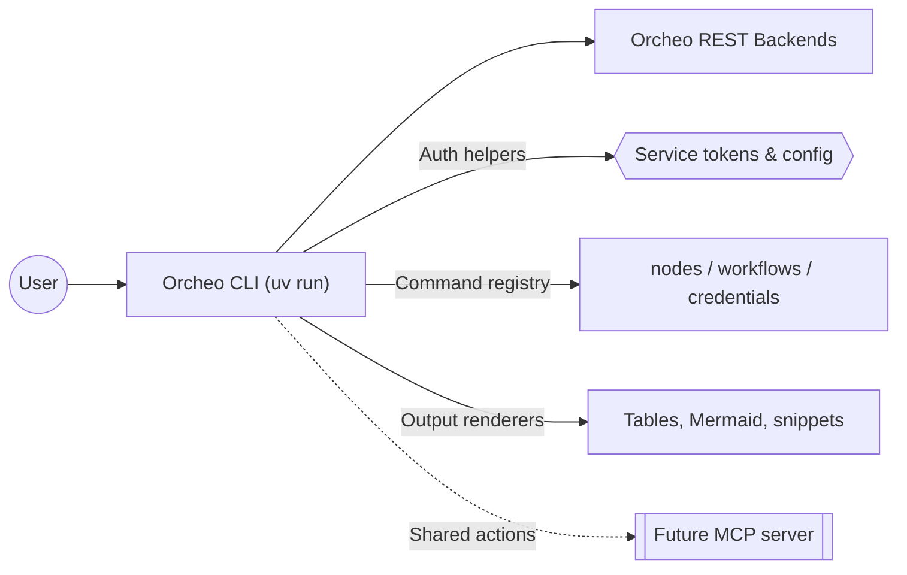

# Orcheo CLI Design

## Purpose

Extend Orcheo's developer tooling with a command-line interface tailored for
LangGraph-first workflows. The CLI gives code-centric teams insight into the
same workflow, node, and credential data that the canvas exposes while staying
aligned with the shared REST APIs and authentication flows.

## Goals

- **Node discovery** – enumerate available nodes, surface metadata (inputs,
  outputs, categories), and filter by tags so developers can quickly find the
  building blocks they need from the terminal.
- **Workflow management** – list, inspect, and trigger workflows that were
  authored via code or canvas. Retrieval includes version history, execution
  status, and the ability to output a Mermaid representation for quick
  visualization in docs or terminals.
- **Credential management** – show credential status, expiry details, and vault
  scopes. Generate reference snippets in the `[[cred_name]]` format to keep CLI
  onboarding aligned with SDK usage.
- **Reference code generation** – scaffold Python snippets that demonstrate how
  to instantiate nodes, set credentials, and run graphs so developers can copy
  and paste working examples.
- **Future MCP packaging** – share the same command implementations via an MCP
  server so AI coding agents can rely on the CLI contract without bespoke
  integrations.

## Non-goals

- Replacing the canvas UX or providing full workflow editing capabilities in
  the terminal. The CLI focuses on inspection, execution, and reference
  generation that augment existing code-first workflows.
- Shipping a custom authentication mechanism. The CLI consumes the service
  token model defined in `authentication_design.md`.

## Command Surface

The CLI adds a new `orcheo` entry point with the following high-level command
groups:

| Command | Description |
|---------|-------------|
| `orcheo nodes list [--tag ai]` | Return nodes with metadata (name, type, version, tags). |
| `orcheo nodes show <node>` | Display node schema, inputs/outputs, credential requirements. |
| `orcheo workflows list` | List workflows with owner, last run, and status. |
| `orcheo workflows show <workflow>` | Print workflow summary, Mermaid graph, and latest runs. |
| `orcheo workflows run <workflow>` | Trigger an execution and stream status to the console. |
| `orcheo credentials list` | Surface credential names, scopes, expiry, and health. |
| `orcheo credentials create <template>` | Provision a credential from a template with guided prompts. |
| `orcheo credentials update <cred>` | Rotate secrets or edit metadata for an existing credential. |
| `orcheo credentials delete <cred>` | Revoke a credential with confirmation safeguards. |
| `orcheo credentials reference <cred>` | Emit the `[[cred_name]]` snippet and usage guidance. |
| `orcheo code scaffold <workflow>` | Generate Python snippets that invoke the workflow or nodes. |

Each command uses the existing REST APIs exposed by the backend. Shared helpers
handle:

- Authentication via service tokens shared with the SDK.
- Pagination and table rendering via rich text output.
- Mermaid generation for workflows using the canonical graph definition from
  the backend so the CLI stays consistent with the canvas exports.

## Architecture Overview

Mermaid diagrams will use the default theme to maximize compatibility across renderers.

The CLI will live inside `packages/sdk` to reuse the existing HTTP client,
models, and authentication primitives. A thin `main.py` entry point exposes the
`orcheo` console script while individual command modules focus on API
translation and presentation.

## Implementation Plan

1. **Bootstrap CLI package** – add Typer- or Click-based command registry under
   `packages/sdk/orcheo_sdk/cli/`, wire into `pyproject.toml`, and document
   installation via `uv run orcheo-cli ...`.
2. **Node discovery commands** – call node catalog endpoints, render tables, and
   support filtering flags.
3. **Workflow management commands** – implement list/show/run with Mermaid
   output and execution streaming.
4. **Credential commands** – list credentials, show health, manage create/
   update/delete flows, and output `[[cred_name]]` helper text.
5. **Reference generation** – scaffold Python snippets that import `orcheo-sdk`
   helpers for node instantiation and run triggers.
6. **MCP packaging spike** – prove that the same command registry can be wrapped
   in an MCP server without duplicating business logic.

## Open Questions

- Do we need offline caching for node metadata to support air-gapped scripting?

## Tracking

- Owner: Developer tooling squad
- Target milestone: Milestone 5 (Node Ecosystem & Integrations)
- Status: Planned

