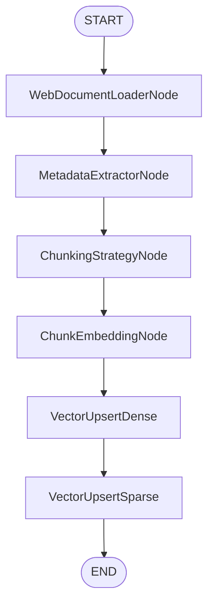

# Conversational Search Examples

!!! warning "Prerequisites"
    Working with these examples requires at least finishing the [Quick Start](index.md#quick-start) OR the [Manual Setup Quick Start](manual_setup.md#quick-start) first.

!!! tip "AI Coding Assistants"
    If you use [Claude Code](https://claude.ai/code), [Codex CLI](https://github.com/openai/codex), or [Cursor](https://cursor.com), we recommend installing the `orcheo-demos` skill from [agent-skills](https://github.com/ShaojieJiang/agent-skills) to streamline running and deploying these demos.

This guide walks you through a progressive demo suite for building conversational search applications with Orcheo. Each demo builds on the previous one, taking you from basic RAG to production-ready evaluation pipelines.

## Overview

| Demo | Description | Source | Credentials Required | External Services | Online Demo |
|------|-------------|--------|---------------------|-------------------|-------------|
| Web Scrape & Upload | Scrape web pages, chunk text, generate embeddings, upload to MongoDB | `examples/mongodb_agent/01_web_scrape_and_upload.py` | `openai_api_key`, `mongodb_uri` | MongoDB Atlas | — |
| MongoDB Indexes | Create text and vector indexes for hybrid search | `examples/mongodb_agent/02_create_index_and_hybrid_search.py` | `mongodb_uri` | MongoDB Atlas | — |
| MongoDB RAG Agent | AI agent with MongoDB hybrid search tool | `examples/mongodb_agent/03_qa_agent.py` | `openai_api_key`, `mongodb_uri` | MongoDB Atlas | [Try it](https://orcheo-canvas.ai-colleagues.com/chat/d26b9777-a43a-4d7e-a586-7501c2b01373) |
| Pinecone Indexes | Create dense & sparse Pinecone indexes from web pages | `examples/conversational_search/demo_1_hybrid_indexing/demo_1.py` | `openai_api_key`, `pinecone_api_key` | Pinecone | — |
| Basic RAG | Basic RAG pipeline (in-memory store) | `examples/conversational_search/demo_2_basic_rag/demo_2.py` | `openai_api_key` | None | — |
| Hybrid Search | Hybrid search + web search + rerank | `examples/conversational_search/demo_3_hybrid_search/demo_3.py` | `openai_api_key`, `pinecone_api_key`, `tavily_api_key` | Pinecone, Tavily | — |
| Conversational Search | Conversational search | `examples/conversational_search/demo_4_conversational/demo_4.py` | `openai_api_key`, `pinecone_api_key` | Pinecone | — |
| Production Pipeline | Production-ready pipeline with caching and guardrails | `examples/conversational_search/demo_5_production/demo_5.py` | `openai_api_key`, `pinecone_api_key` | Pinecone | — |
| Evaluation & Research | Evaluation & research | `examples/conversational_search/demo_6_evaluation/demo_6.py` | `openai_api_key`, `pinecone_api_key` | Pinecone | — |

**Tip:** The example script paths are relative to the Orcheo source root or the GitHub repository root.

## Prerequisites

### Install Dependencies

```bash
uv sync --group examples
```

This installs the `examples` dependency group including `orcheo-backend` for credential vault access.

### Set Up Credentials

Store credentials securely in the Orcheo vault:

```bash
# Required for all demos
orcheo credential create openai_api_key --secret sk-your-openai-key

# Required for Hybrid Search (web search)
orcheo credential create tavily_api_key --secret tvly-your-tavily-key

# Required for Pinecone-based demos (Pinecone Indexes, Hybrid Search, Conversational Search, Production Pipeline, Evaluation & Research)
orcheo credential create pinecone_api_key --secret your-pinecone-key
```

## MongoDB Agent Demos

These demos show how to build AI agents with MongoDB Atlas as the vector store backend.

### Web Scrape & Upload

Scrapes web pages, chunks the body text, generates vector embeddings, and uploads the results to a MongoDB collection.

```bash
orcheo workflow upload examples/mongodb_agent/01_web_scrape_and_upload.py --name "Web Scrape & Upload" --config-file examples/mongodb_agent/config.json
orcheo workflow run
```

The running should produce output like:

```console
Starting workflow execution...
Execution ID: 5a64424e-a506-46f7-9de9-3a107295a471

Trace update: workflow.execution (UNSET)
• web_loader (results)
Trace update: web_loader (UNSET)
• chunking (results)
Trace update: chunking (UNSET)
• chunk_embedding (results)
Trace update: chunk_embedding (UNSET)
• mongodb_upload (results)
Trace update: mongodb_upload (UNSET)
✓ Workflow completed successfully
```

### MongoDB Indexes

Creates text and vector search indexes in MongoDB Atlas for hybrid search capabilities.

```bash
orcheo workflow upload examples/mongodb_agent/02_create_index_and_hybrid_search.py --name "MongoDB Indexes" --config-file examples/mongodb_agent/config.json
orcheo workflow run <workflow-id>
```

The running should produce output like:

```console
Starting workflow execution...
Execution ID: 11672ce8-0a07-4dc6-adbe-b64408e54b6c

Trace update: workflow.execution (UNSET)
• ensure_text_index (results)
Trace update: ensure_text_index (UNSET)
• ensure_vector_index (results)
Trace update: ensure_vector_index (UNSET)
✓ Workflow completed successfully
```

### MongoDB RAG Agent

An AI agent with a MongoDB hybrid search tool. The agent can answer questions by searching the MongoDB collection using both text and vector search.

This demo is best experienced through the integrated ChatKit UI by uploading and publishing the workflow:

```bash
orcheo workflow upload examples/mongodb_agent/03_qa_agent.py --name "MongoDB RAG Agent" --config-file examples/mongodb_agent/config.json
orcheo workflow publish <workflow-id> --force
```

Then you can interact with the agent through the generated link.

Alternatively, you can try the online demo directly:
**[Try the online demo →](https://orcheo-canvas.ai-colleagues.com/chat/d26b9777-a43a-4d7e-a586-7501c2b01373)**

!!! tip "Try asking about UvA"
    The knowledge base for this demo contains only University of Amsterdam (UvA) news articles. Try questions like "What's the latest research at UvA?" or "Tell me about UvA news" for the best results.

<iframe
  src="https://orcheo-canvas.ai-colleagues.com/chat/d26b9777-a43a-4d7e-a586-7501c2b01373"
  width="100%"
  height="700"
  frameborder="0"
  style="border: 1px solid #ddd; border-radius: 8px;">
</iframe>

## Pinecone Indexes

Create dense and sparse Pinecone indexes from web pages. This demo scrapes URLs,
chunks the text, generates both dense (OpenAI) and sparse (BM25) embeddings, and
upserts them into two separate Pinecone indexes.

### What It Does

- Scrapes web pages specified in `config.json`
- Extracts metadata and infers document titles from the first line
- Chunks text with configurable size and overlap
- Generates dense embeddings (OpenAI `text-embedding-3-small`) and sparse embeddings (Pinecone BM25)
- Upserts dense and sparse vectors into separate Pinecone indexes

### Run It

Upload and run through Orcheo:

```bash
orcheo workflow upload examples/conversational_search/demo_1_hybrid_indexing/demo_1.py --name "Pinecone Indexes" --config-file examples/conversational_search/demo_1_hybrid_indexing/config.json
orcheo workflow run <workflow-id>
```

The default `config.json` scrapes UvA news articles and writes to the
`orcheo-demo-dense` and `orcheo-demo-sparse` indexes under the `hybrid_search`
namespace. Edit `config.json` to customise the URLs or index settings.

### Configuration

```json
{
  "configurable": {
    "urls": [
      {"url": "https://example.com/page-1"},
      {"url": "https://example.com/page-2"}
    ],
    "chunk_size": 512,
    "chunk_overlap": 64,
    "dense_embedding_method": "embedding:openai:text-embedding-3-small",
    "sparse_embedding_method": "embedding:pinecone:bm25-default",
    "vector_store_index_dense": "orcheo-demo-dense",
    "vector_store_index_sparse": "orcheo-demo-sparse",
    "vector_store_namespace": "hybrid_search"
  }
}
```

### Workflow Diagram



## Basic RAG Pipeline

The simplest starting point. This demo works entirely locally with no external vector database.

### What It Does

- Routes queries through ingestion, search, or direct generation based on context
- Uses an in-memory vector store for document embeddings
- Uses a demo embedding function for retrieval; OpenAI is used for grounded generation
- Produces grounded responses with inline citations

### Run It

Upload and run through Orcheo:

```bash
orcheo workflow upload examples/conversational_search/demo_2_basic_rag/demo_2.py --name "Basic RAG" --config-file examples/conversational_search/demo_2_basic_rag/config.json
orcheo workflow run <workflow-id> --inputs '{"message": "What is this document about?"}'
orcheo workflow run <workflow-id> --inputs '{"documents":[{"storage_path":"/abs/path/document.txt","source":"document.txt","metadata":{"category":"tech"}}],"message":"What is this document about?"}'
```

**What to expect:**

- If `documents` are provided, ingestion runs first and (when `message` is present)
  the workflow continues to retrieval + grounded generation.
- If no documents are provided and the in-memory store already has chunks from prior
  runs, the workflow skips ingestion and performs search + generation.
- If no documents are provided and the store is empty, the workflow answers directly.

### Configuration

```json
{
  "configurable": {
    "chunk_size": 512,
    "chunk_overlap": 64,
    "top_k": 5,
    "similarity_threshold": 0.0
  }
}
```

Adjust `chunk_size`, `chunk_overlap`, `top_k`, and `similarity_threshold` in `config.json` to tune the pipeline.

### Workflow Diagram


## Hybrid Search

Dense + sparse retrieval with reciprocal-rank fusion and optional web search.

### Prerequisites

Run Pinecone Indexes first to populate the Pinecone indexes.

### Run It

```bash
orcheo workflow upload examples/conversational_search/demo_3_hybrid_search/demo_3.py --name "Hybrid Search" --config-file examples/conversational_search/demo_3_hybrid_search/config.json
orcheo workflow publish <workflow-id> --force
```

> **Note:** Publishing the workflow before running it is recommended, as published workflows benefit from optimised execution.

**What to expect:**

- Queries fan out across dense (vector), sparse (BM25), and web search branches
- Results are fused with reciprocal-rank fusion, reranked in Pinecone, and
  summarized before generation
- Outputs a grounded answer with citations

### Configuration

```json
{
  "configurable": {
    "dense_top_k": 8,
    "dense_similarity_threshold": 0.0,
    "dense_embedding_method": "embedding:openai:text-embedding-3-small",
    "sparse_top_k": 10,
    "sparse_score_threshold": 0.0,
    "sparse_vector_store_candidate_k": 50,
    "sparse_embedding_method": "embedding:pinecone:bm25-default",
    "web_search_provider": "tavily",
    "web_search_max_results": 5,
    "web_search_search_depth": "advanced",
    "fusion_rrf_k": 60,
    "fusion_top_k": 8,
    "context_max_tokens": 400,
    "context_summary_model": "openai:gpt-4o-mini",
    "vector_store_index_dense": "orcheo-demo-dense",
    "vector_store_index_sparse": "orcheo-demo-sparse",
    "vector_store_namespace": "hybrid_search",
    "reranker_model": "bge-reranker-v2-m3",
    "reranker_top_n": 10,
    "generation_model": "openai:gpt-4o-mini"
  }
}
```

Edit `config.json` to customise retrieval parameters, models, or index settings.

**Tips**: Try asking questions about the indexed content, or ask open-domain questions — thanks to [Tavily](https://tavily.com/) web search integration, the system can answer general knowledge queries beyond the indexed documents.

<!-- TODO: Add an embedded online demo here -->

## Conversational Search

Stateful, multi-turn chat with conversation memory and query rewriting.

### What It Does

- **ConversationStateNode**: Maintains session history and summary
- **QueryClassifierNode**: Routes to search, clarification, or finalize branches
- **CoreferenceResolverNode**: Rewrites pronouns using recent context
- **TopicShiftDetectorNode**: Flags topic divergence
- **MemorySummarizerNode**: Persists compact summaries at finalization

### Prerequisites

Run Pinecone Indexes first to populate the Pinecone indexes.

### Run It

```bash
orcheo workflow upload examples/conversational_search/demo_4_conversational/demo_4.py --name "Conversational Search" --config-file examples/conversational_search/demo_4_conversational/config.json
orcheo workflow run <workflow-id> --inputs '{"message": "How does authentication work?"}'
```

**What to expect:**

Iterate across multiple turns to see:

- Query classification and coreference resolution for follow-ups
- Clarification prompts when ambiguity is detected
- Topic-shift detection
- Memory summarization when the conversation is finalized
- Grounded responses with properly formatted citations and references

### Configuration

```json
{
  "configurable": {
    "conversation": {
      "max_turns": 20,
      "max_sessions": 8,
      "max_total_turns": 160
    },
    "query_processing": {
      "topic_shift": {
        "similarity_threshold": 0.4,
        "recent_turns": 3
      }
    },
    "retrieval": {
      "top_k": 3,
      "score_threshold": 0.0
    },
    "generation": {
      "citation_style": "inline"
    },
    "vector_store": {
      "type": "pinecone",
      "index_name": "orcheo-demo-dense",
      "namespace": "hybrid_search",
      "client_kwargs": {
        "api_key": "[[pinecone_api_key]]"
      }
    }
  }
}
```

Edit `config.json` to customize conversation limits, retrieval parameters, or vector store settings.

## Production Pipeline

Production-focused scaffold with caching, guardrails, streaming, and multi-hop planning.

### Features

- **Caching**: Response caching for repeated queries
- **Guardrails**: Hallucination detection and policy checks
- **Citation formatting**: Properly formatted references with source details
- **Streaming**: Streaming generator for fast iteration
- **Multi-hop planning**: Plans chained search queries
- **Session controls**: Conversation state and memory privacy hooks

### Prerequisites

Run Pinecone Indexes first to populate the Pinecone indexes.

### Run It

This demo is designed for the Orcheo server:

```bash
orcheo workflow upload examples/conversational_search/demo_5_production/demo_5.py --name "Production Pipeline" --config-file examples/conversational_search/demo_5_production/config.json
```

Execute via the Orcheo Console or API.

### Configuration

```json
{
  "configurable": {
    "retrieval": {
      "vector_store": {
        "type": "pinecone",
        "index_name": "orcheo-demo-dense",
        "namespace": "hybrid_search",
        "client_kwargs": {
          "api_key": "[[pinecone_api_key]]"
        }
      },
      "top_k": 4,
      "score_threshold": 0.0,
      "embedding_method": "embedding:openai:text-embedding-3-small"
    },
    "session": {
      "max_sessions": 8,
      "max_turns": 20,
      "max_total_turns": 200
    },
    "caching": {
      "ttl_seconds": 3600,
      "max_entries": 128
    },
    "multi_hop": {
      "max_hops": 3
    },
    "memory_privacy": {
      "retention_count": 32
    },
    "guardrails": {
      "blocked_terms": ["password", "ssn"]
    },
    "streaming": {
      "chunk_size": 8,
      "buffer_limit": 64
    }
  }
}
```

Edit `config.json` to customize:
- **Retrieval**: Vector store settings, top-k results, and embedding method
- **Session**: Conversation limits and turn constraints
- **Caching**: TTL and cache size for response caching
- **Multi-hop**: Maximum hops for multi-step query planning
- **Memory Privacy**: Retention count for privacy-aware memory management
- **Guardrails**: Blocked terms for policy compliance checks
- **Streaming**: Chunk size and buffer limits for streaming generation

## Evaluation & Research

Evaluation-focused scaffold with golden datasets, retrieval A/B testing, and
LLM-based judging.

### What's Included

- **Golden queries**: Defaults to GitHub raw data under
  `examples/conversational_search/data/golden/golden_dataset.json`
- **Relevance labels**: Defaults to GitHub raw
  `examples/conversational_search/data/labels/relevance_labels.json`
- **Variant definitions**: Compare dense-only vs hybrid retrieval strategies

### Prerequisites

Run Pinecone Indexes first to populate the Pinecone indexes.

### Run It

```bash
orcheo workflow upload examples/conversational_search/demo_6_evaluation/demo_6.py --name "Evaluation & Research" --config-file examples/conversational_search/demo_6_evaluation/config.json
```

Execute via the Orcheo Console or API to run evaluation sweeps.

### Configuration

```json
{
  "recursion_limit": 250,
  "tags": ["conversational-search", "demo-6", "evaluation"],
  "configurable": {
    "dataset": {
      "golden_path": "https://raw.githubusercontent.com/ShaojieJiang/orcheo/refs/heads/main/examples/conversational_search/data/golden/golden_dataset.json",
      "queries_path": "https://raw.githubusercontent.com/ShaojieJiang/orcheo/refs/heads/main/examples/conversational_search/data/queries.json",
      "labels_path": "https://raw.githubusercontent.com/ShaojieJiang/orcheo/refs/heads/main/examples/conversational_search/data/labels/relevance_labels.json",
      "docs_path": "https://raw.githubusercontent.com/ShaojieJiang/orcheo/refs/heads/main/examples/conversational_search/data/docs/product_overview.md",
      "split": "test",
      "limit": null
    },
    "retrieval": {
      "top_k": 4,
      "embedding_method": "embedding:openai:text-embedding-3-small",
      "sparse_embedding_method": "embedding:pinecone:bm25-default",
      "sparse_top_k": 4,
      "sparse_candidate_k": 50,
      "sparse_score_threshold": 0.0,
      "fusion": {
        "strategy": "rrf",
        "rrf_k": 30,
        "top_k": 4
      }
    },
    "vector_store": {
      "type": "pinecone",
      "pinecone": {
        "index_name": "orcheo-demo-dense",
        "namespace": "hybrid_search",
        "client_kwargs": {
          "api_key": "[[pinecone_api_key]]"
        }
      }
    },
    "sparse_vector_store": {
      "type": "pinecone",
      "pinecone": {
        "index_name": "orcheo-demo-sparse",
        "namespace": "hybrid_search",
        "client_kwargs": {
          "api_key": "[[pinecone_api_key]]"
        }
      }
    },
    "generation": {
      "citation_style": "inline",
      "model": "openai:gpt-4o-mini"
    },
    "ab_testing": {
      "experiment_id": "retrieval_comparison_001",
      "min_metric_threshold": 0.35
    },
    "llm_judge": {
      "min_score": 0.5,
      "model": "openai:gpt-4o-mini"
    }
  }
}
```

Edit `config.json` to customize:
- **Dataset**: Paths to golden queries, relevance labels, and test documents
- **Retrieval**: Top-k results, embedding methods, fusion strategy
- **Vector store**: Pinecone index names and namespaces for dense and sparse indexes
- **Generation**: Citation style and model for answer generation
- **A/B testing**: Experiment ID and minimum metric threshold for rollout decisions
- **LLM judge**: Minimum score threshold and model for quality evaluation

## Deploying Demos to Orcheo

All demos can be uploaded and run on the Orcheo server:

```bash
# Upload a demo
orcheo workflow upload examples/conversational_search/demo_2_basic_rag/demo_2.py

# Upload a demo with config
orcheo workflow upload examples/conversational_search/demo_6_evaluation/demo_6.py --config-file examples/conversational_search/demo_6_evaluation/config.json

# List workflows
orcheo workflow list

# Run a workflow
orcheo workflow run <workflow-id> --inputs '{"message": "What is Orcheo?"}'
```

The server detects the `build_graph()` entrypoint automatically. Configuration can be provided via `--config-file` or through a `DEFAULT_CONFIG` variable in the workflow file.

## Sample Data

The demos share sample data in `examples/conversational_search/data/`:

- `docs/`: Sample documents (authentication, product overview, troubleshooting)
- `queries.json`: Baseline queries for testing
- `golden/`: Golden datasets for evaluation
- `labels/`: Relevance labels for metrics

Pinecone Indexes reads URLs from its `config.json`. Evaluation & Research defaults to GitHub raw URLs.
You can point configs at these local files when running offline or customising the corpus.

## Next Steps

- Try the MongoDB Agent demos for MongoDB Atlas-based vector search
- Start with Basic RAG to understand the basic RAG pattern
- Run Pinecone Indexes before Hybrid Search, Conversational Search, Production Pipeline, and Evaluation & Research to seed the Pinecone indexes
- Progress through Hybrid Search and Conversational Search to add hybrid search and conversation state
- Use Production Pipeline patterns for production deployments
- Set up Evaluation & Research for systematic evaluation of your search quality
