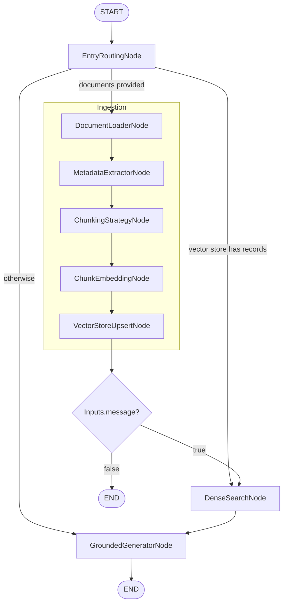

# Conversational Search Examples

!!! note "Prerequisites"
    Working with these examples requires at least finishing the [Quick Start](manual_setup.md#quick-start) section first.

This guide walks you through a progressive demo suite for building conversational search applications with Orcheo. Each demo builds on the previous one, taking you from basic RAG to production-ready evaluation pipelines.

## Overview

| Demo | Description | Credentials Required | External Services |
|------|-------------|---------------------|-------------------|
| Demo 1 | Basic RAG pipeline | `openai_api_key` | None (in-memory) |
| Demo 2 | Hybrid search with fusion | `openai_api_key`, `tavily_api_key` | Pinecone |
| Demo 3 | Conversational search | `openai_api_key`, `pinecone_api_key` | Pinecone |
| Demo 4 | Production-ready pipeline | `openai_api_key`, `pinecone_api_key` | Pinecone |
| Demo 5 | Evaluation & research | `openai_api_key`, `pinecone_api_key` | Pinecone |

## Prerequisites

### Install Dependencies

```bash
uv sync --group examples
```

This installs the `examples` dependency group including `orcheo-backend` for credential vault access.

### Set Up Credentials

Store credentials securely in the Orcheo vault (`~/.orcheo/vault.sqlite`):

```bash
# Required for all demos
orcheo credential create openai_api_key --secret sk-your-openai-key

# Required for Demo 2 (web search)
orcheo credential create tavily_api_key --secret tvly-your-tavily-key

# Required for Demos 2-5 (Pinecone)
orcheo credential create pinecone_api_key --secret your-pinecone-key
```

### Verify Setup

Run the setup checker to verify all prerequisites:

```bash
python examples/conversational_search/check_setup.py
```

This checks your Python version, dependencies, credentials, and data files.

## Demo 1: Basic RAG Pipeline

The simplest starting point. This demo works entirely locally with no external vector database.

### What It Does

- Routes queries through ingestion, search, or direct generation based on context
- Uses an in-memory vector store for document embeddings
- Produces grounded responses with inline citations

### Run It

```bash
python examples/conversational_search/demo_1_basic_rag/demo_1.py
```

**What to expect:**

1. **Non-RAG phase**: Runs the graph before any documents are indexed (direct answering)
2. **RAG phase**: Creates a temporary file, ingests it, and demonstrates retrieval + grounded generation

### Configuration

```python
DEFAULT_CONFIG = {
    "ingestion": {
        "chunking": {
            "chunk_size": 512,
            "chunk_overlap": 64,
        },
    },
    "retrieval": {
        "search": {
            "top_k": 5,
            "similarity_threshold": 0.0,
        },
    },
}
```

Adjust `chunk_size`, `chunk_overlap`, `top_k`, and `similarity_threshold` to tune the pipeline.

### Workflow Diagram



## Demo 0 + Demo 2: Hybrid Search

Dense + sparse retrieval with reciprocal-rank fusion and optional web search.

### Step 1: Index the Corpus (Demo 0)

First, populate the Pinecone indexes with sample data:

```bash
python examples/conversational_search/demo_0_hybrid_indexing/demo_0.py
```

This upserts embeddings and metadata into Pinecone from the sample corpus in `examples/conversational_search/data/docs`.

### Step 2: Run Hybrid Search (Demo 2)

```bash
python examples/conversational_search/demo_2_hybrid_search/demo_2.py
```

**What to expect:**

- Queries fan out across dense (vector), sparse (BM25), and web search branches
- Results are fused using reciprocal-rank fusion
- Outputs a grounded answer with citations

### Deploy to Orcheo Server

Upload and run via the Orcheo platform:

```bash
orcheo workflow upload examples/conversational_search/demo_0_hybrid_indexing/demo_0.py
orcheo workflow upload examples/conversational_search/demo_2_hybrid_search/demo_2.py
```

## Demo 3: Conversational Search

Stateful, multi-turn chat with conversation memory and query rewriting.

### What It Does

- **ConversationStateNode**: Maintains session history and summary
- **QueryClassifierNode**: Routes to search, clarification, or finalize branches
- **CoreferenceResolverNode**: Rewrites pronouns using recent context
- **TopicShiftDetectorNode**: Flags topic divergence
- **MemorySummarizerNode**: Persists compact summaries at finalization

### Prerequisites

Run Demo 0 first to populate the Pinecone indexes.

### Run It

```bash
python examples/conversational_search/demo_3_conversational/demo_3.py
```

**What to expect:**

The script steps through five scripted turns demonstrating:

- Query classification and coreference resolution for follow-ups
- Clarification prompts when ambiguity is detected
- Topic-shift detection
- Memory summarization at conversation end

### Configuration

```python
DEFAULT_CONFIG = {
    "conversation": {"max_turns": 20, "max_sessions": 8, "max_total_turns": 160},
    "query_processing": {"topic_shift": {"similarity_threshold": 0.4, "recent_turns": 3}},
    "retrieval": {"top_k": 3, "score_threshold": 0.0},
    "generation": {"citation_style": "inline"},
    "vector_store": {
        "type": "pinecone",
        "index_name": "orcheo-demo-dense",
        "namespace": "hybrid_search",
    },
}
```

## Demo 4: Production-Ready Pipeline

Production-focused scaffold with caching, guardrails, streaming, and incremental indexing.

### Features

- **Caching**: Response caching for repeated queries
- **Guardrails**: Hallucination detection and policy checks
- **Streaming**: Optimized for fast iteration
- **Incremental indexing**: Efficient document updates

### Run It

This demo is designed for the Orcheo server:

```bash
orcheo workflow upload examples/conversational_search/demo_4_production/demo_4.py
```

Execute via the Orcheo Console or API.

## Demo 5: Evaluation & Research

Evaluation-focused scaffold with golden datasets and retrieval A/B testing.

### What's Included

- **Golden queries**: `examples/conversational_search/data/golden/golden_dataset.json`
- **Relevance labels**: `examples/conversational_search/data/labels/relevance_labels.json`
- **Variant definitions**: Compare different retrieval strategies

### Prerequisites

Run Demo 0 first to populate the Pinecone indexes.

### Run It

```bash
orcheo workflow upload examples/conversational_search/demo_5_evaluation/demo_5.py
```

Execute via the Orcheo Console or API to run evaluation sweeps.

## Deploying Demos to Orcheo

All demos can be uploaded and run on the Orcheo server:

```bash
# Upload a demo
orcheo workflow upload examples/conversational_search/demo_1_basic_rag/demo_1.py

# List workflows
orcheo workflow list

# Run a workflow
orcheo workflow run <workflow-id> --inputs '{"message": "What is Orcheo?"}'
```

The server detects the `build_graph()` entrypoint and `DEFAULT_CONFIG` automatically.

## Sample Data

The demos share sample data in `examples/conversational_search/data/`:

- `docs/`: Sample documents (authentication, product overview, troubleshooting)
- `queries.json`: Baseline queries for testing
- `golden/`: Golden datasets for evaluation
- `labels/`: Relevance labels for metrics

Replace these with your own domain content to experiment.

## Next Steps

- Start with Demo 1 to understand the basic RAG pattern
- Progress through Demos 2-3 to add hybrid search and conversation state
- Use Demo 4 patterns for production deployments
- Set up Demo 5 for systematic evaluation of your search quality
