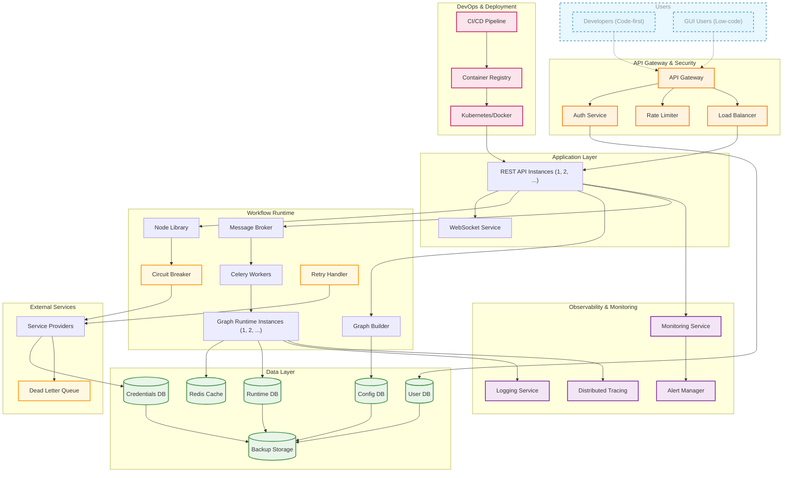

# Architecture of this project

The design philosophy of this project can be summarised as follows:
1. Backend-first: The backend is the core of the project, and the frontend is a powerful extension but optional. Developers can also design their own frontend or clients to interact with the backend.
2. Low-code and code-first: Normal users and developers can just specify configuration to use the platform. Advanced developers can use components in the Python SDK in code-first manner.

## Backend

## Frontend

```mermaid
graph TD
    subgraph "User Interface Layer"
        AuthUI[Authentication UI]
        Dashboard[Dashboard]
        CanvasUI[Workflow Canvas UI]
        SettingsUI[Settings UI]
    end

    subgraph "Core Modules"
        AuthModule[Authentication Module]
        CanvasModule[Workflow Canvas]
        NodeLibraryModule[Node Library]
        TracesModule[Traces & Monitoring]
        ConfigModule[Configuration Module]
    end

    subgraph "Node & Graph Management"
        NodeEditor[Node Editor]
        AgenticTools[Agentic Tools Manager]
        SubgraphConfig[Sub-graph Configuration]
        GraphConfig[Graph Configuration]
        NodeRegistry[Node Registry]
    end

    subgraph "API Communication"
        APIClient[API Client]
        WebSocketClient[WebSocket Client]
        AuthService[Auth Service]
        WorkflowService[Workflow Service]
        NodeService[Node Service]
    end

    subgraph "Utilities & Services"
        ValidationService[Validation Service]
        CacheService[Cache Service]
        EventBus[Event Bus]
        NotificationService[Notification Service]
        ThemeService[Theme Service]
    end

    %% UI to Module connections
    AuthUI --> AuthModule
    Dashboard --> TracesModule
    CanvasUI --> CanvasModule
    CanvasUI --> NodeLibraryModule
    SettingsUI --> ConfigModule

    %% Module to Node/Graph Management
    CanvasModule --> NodeEditor
    CanvasModule --> GraphConfig
    NodeLibraryModule --> NodeRegistry
    NodeEditor --> AgenticTools
    NodeEditor --> SubgraphConfig
    ConfigModule --> GraphConfig

    %% API Communication connections
    AuthModule --> AuthService
    CanvasModule --> WorkflowService
    NodeLibraryModule --> NodeService
    TracesModule --> WebSocketClient
    AuthService --> APIClient
    WorkflowService --> APIClient
    NodeService --> APIClient
    NodeService --> WebSocketClient

    %% Utilities connections
    NodeEditor --> ValidationService
    GraphConfig --> ValidationService
    APIClient --> CacheService
    TracesModule --> NotificationService
    CanvasModule --> EventBus
    AuthModule --> ThemeService

    %% Backend connection
    APIClient -.->|REST API| Backend[Backend APIs]
    WebSocketClient -.->|WebSocket| Backend

    %% Styling
    classDef uiNodes fill:#e3f2fd,stroke:#1976d2,stroke-width:2px
    classDef coreNodes fill:#f3e5f5,stroke:#7b1fa2,stroke-width:2px
    classDef nodeNodes fill:#fff3e0,stroke:#f57c00,stroke-width:2px
    classDef apiNodes fill:#fff8e1,stroke:#ff8f00,stroke-width:2px
    classDef utilityNodes fill:#fce4ec,stroke:#c2185b,stroke-width:2px
    classDef backendNodes fill:#f5f5f5,stroke:#616161,stroke-width:2px,stroke-dasharray: 5 5

    class AuthUI,Dashboard,CanvasUI,SettingsUI uiNodes
    class AuthModule,CanvasModule,NodeLibraryModule,TracesModule,ConfigModule coreNodes
    class NodeEditor,AgenticTools,SubgraphConfig,GraphConfig,NodeRegistry nodeNodes
    class APIClient,WebSocketClient,AuthService,WorkflowService,NodeService apiNodes
    class ValidationService,CacheService,EventBus,NotificationService,ThemeService utilityNodes
    class Backend backendNodes
```

