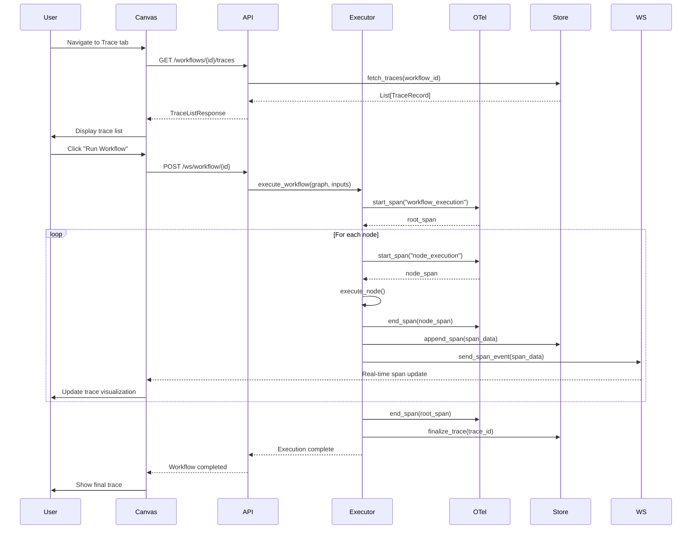

# OpenTelemetry Tracing Design

## Overview

This document describes the technical design and architecture for implementing OpenTelemetry-based distributed tracing in Orcheo. The design integrates with the existing execution history system while providing a dedicated, standards-compliant tracing layer.

**Last Updated:** 2025-11-13
**Status:** Draft
**Related Documents:**
- [Requirements Document](./requirements.md)
- [Implementation Plan](./plan.md)
- [Milestone 6 Roadmap](../roadmap.md)

---

## Table of Contents

1. [Architecture Overview](#architecture-overview)
2. [Component Design](#component-design)
3. [Data Model](#data-model)
4. [API Design](#api-design)
5. [Frontend Design](#frontend-design)
6. [Integration Points](#integration-points)
7. [Security Considerations](#security-considerations)
8. [Performance Optimization](#performance-optimization)

---

## Architecture Overview

### High-Level Architecture

```
┌─────────────────────────────────────────────────────────────────┐
│                        Canvas Frontend                           │
│  ┌───────────┬───────────┬───────────┬───────────┬───────────┐  │
│  │  Editor   │ Execution │   Trace   │ Readiness │ Settings  │  │
│  └───────────┴───────────┴─────┬─────┴───────────┴───────────┘  │
│                                 │                                 │
│                         TraceTabContent                          │
│                    ┌────────────┴─────────────┐                  │
│                    │                          │                  │
│              TraceListView            TraceDetailView            │
│                    │                          │                  │
│                    │    ┌─────────────────────┤                  │
│                    │    │                     │                  │
│              SpanTimeline              SpanDetailsPanel          │
└────────────────────┼────┼─────────────────────┼──────────────────┘
                     │    │                     │
                  WebSocket ← ─ ─ ─ ─ ─ ─ ─ ─ ┘
                     │    │
                  HTTP API │
                     │    │
┌────────────────────┼────┼─────────────────────┼──────────────────┐
│                 Backend │(FastAPI)             │                  │
│                    ▼    ▼                     ▼                  │
│         ┌──────────────────────┐   ┌──────────────────┐         │
│         │   Trace API Router   │   │  WebSocket Router│         │
│         │  /workflows/.../traces│   │  /ws/workflow/...│         │
│         └──────────┬────────────┘   └────────┬─────────┘         │
│                    │                         │                   │
│                    ▼                         │                   │
│         ┌──────────────────────┐             │                   │
│         │    TraceStore        │             │                   │
│         │  (Protocol/Interface)│             │                   │
│         └──────────┬────────────┘             │                   │
│                    │                         │                   │
│         ┌──────────┴───────────┐             │                   │
│         │                      │             │                   │
│    SqliteTraceStore    PostgresTraceStore   │                   │
│         │                      │             │                   │
│         └──────────┬───────────┘             │                   │
│                    │                         │                   │
│                    ▼                         │                   │
│         ┌──────────────────────┐             │                   │
│         │  Instrumentation     │◄────────────┘                   │
│         │  Layer               │                                 │
│         └──────────┬────────────┘                                │
│                    │                                             │
│         ┌──────────▼────────────┐                                │
│         │  OpenTelemetry SDK   │                                 │
│         │  - TracerProvider    │                                 │
│         │  - SpanProcessor     │                                 │
│         │  - Exporter          │                                 │
│         └──────────┬────────────┘                                │
│                    │                                             │
└────────────────────┼─────────────────────────────────────────────┘
                     │
         ┌───────────▼────────────┐
         │  Workflow Execution    │
         │  - workflow_execution.py│
         │  - nodes/base.py       │
         │  - graph/builder.py    │
         └────────────────────────┘
```

### Component Interaction Flow



---

## Component Design

### 1. Backend - OpenTelemetry Integration

#### 1.1 Tracer Provider Setup

**Location:** `apps/backend/src/orcheo_backend/app/tracing/provider.py`

```python
from opentelemetry import trace
from opentelemetry.sdk.trace import TracerProvider
from opentelemetry.sdk.trace.export import BatchSpanProcessor, ConsoleSpanExporter
from opentelemetry.sdk.resources import Resource
from typing import Optional
from .exporters import OrcheoSpanExporter
from .config import TracingConfig

class OrcheoTracerProvider:
    """
    Manages OpenTelemetry tracer provider lifecycle.

    Provides:
    - Configurable span processors (batch, simple)
    - Pluggable exporters (in-memory, OTLP, console)
    - Resource attributes (service name, version, etc.)
    - Graceful shutdown
    """

    def __init__(self, config: TracingConfig) -> None:
        self.config = config
        self._provider: Optional[TracerProvider] = None
        self._setup_provider()

    def _setup_provider(self) -> None:
        """Initialize the tracer provider with configured exporters."""
        resource = Resource.create({
            "service.name": "orcheo-backend",
            "service.version": self.config.version,
            "deployment.environment": self.config.environment,
        })

        self._provider = TracerProvider(resource=resource)

        # Add span processor based on config
        if self.config.exporter_type == "otlp":
            from opentelemetry.exporter.otlp.proto.grpc.trace_exporter import OTLPSpanExporter
            exporter = OTLPSpanExporter(endpoint=self.config.otlp_endpoint)
        elif self.config.exporter_type == "console":
            exporter = ConsoleSpanExporter()
        else:  # in-memory (default)
            exporter = OrcheoSpanExporter(trace_store=self.config.trace_store)

        processor = BatchSpanProcessor(exporter, max_export_batch_size=512)
        self._provider.add_span_processor(processor)

        # Set as global provider
        trace.set_tracer_provider(self._provider)

    def get_tracer(self, name: str) -> trace.Tracer:
        """Get a tracer instance for instrumenting code."""
        return self._provider.get_tracer(name)

    def shutdown(self) -> None:
        """Flush pending spans and shutdown cleanly."""
        if self._provider:
            self._provider.shutdown()

# Global instance
_tracer_provider: Optional[OrcheoTracerProvider] = None

def setup_tracing(config: TracingConfig) -> None:
    """Initialize global tracing provider."""
    global _tracer_provider
    _tracer_provider = OrcheoTracerProvider(config)

def get_tracer(name: str = "orcheo") -> trace.Tracer:
    """Get the global tracer instance."""
    if _tracer_provider is None:
        raise RuntimeError("Tracing not initialized. Call setup_tracing() first.")
    return _tracer_provider.get_tracer(name)

def shutdown_tracing() -> None:
    """Shutdown tracing cleanly."""
    if _tracer_provider:
        _tracer_provider.shutdown()
```

#### 1.2 Configuration

**Location:** `apps/backend/src/orcheo_backend/app/tracing/config.py`

```python
from dataclasses import dataclass
from typing import Literal, Optional
from .span_store import TraceStore

@dataclass
class TracingConfig:
    """Configuration for OpenTelemetry tracing."""

    enabled: bool = True
    exporter_type: Literal["in-memory", "otlp", "console"] = "in-memory"
    otlp_endpoint: Optional[str] = None
    sampling_rate: float = 1.0  # 1.0 = trace everything, 0.1 = trace 10%
    max_attributes_per_span: int = 128
    max_events_per_span: int = 128
    trace_store: Optional[TraceStore] = None
    version: str = "0.1.0"
    environment: str = "development"

    # Attribute sanitization
    sanitize_inputs: bool = True
    sanitize_outputs: bool = True
    sensitive_keys: list[str] = None

    def __post_init__(self) -> None:
        if self.sensitive_keys is None:
            self.sensitive_keys = [
                "password", "secret", "token", "api_key",
                "credential", "auth", "private_key"
            ]

def load_config_from_env() -> TracingConfig:
    """Load tracing configuration from environment variables."""
    import os

    return TracingConfig(
        enabled=os.getenv("ORCHEO_TRACING_ENABLED", "true").lower() == "true",
        exporter_type=os.getenv("ORCHEO_TRACING_EXPORTER", "in-memory"),
        otlp_endpoint=os.getenv("OTEL_EXPORTER_OTLP_ENDPOINT"),
        sampling_rate=float(os.getenv("ORCHEO_TRACING_SAMPLE_RATE", "1.0")),
        environment=os.getenv("ORCHEO_ENV", "development"),
    )
```

#### 1.3 Custom Exporter

**Location:** `apps/backend/src/orcheo_backend/app/tracing/exporters.py`

```python
from opentelemetry.sdk.trace.export import SpanExporter, SpanExportResult
from opentelemetry.sdk.trace import ReadableSpan
from typing import Sequence
from .span_store import TraceStore
from .models import span_to_record

class OrcheoSpanExporter(SpanExporter):
    """
    Custom exporter that writes spans to OrcheoTraceStore.

    This allows us to persist spans in our own database
    while remaining compatible with OpenTelemetry SDK.
    """

    def __init__(self, trace_store: TraceStore) -> None:
        self.trace_store = trace_store

    def export(self, spans: Sequence[ReadableSpan]) -> SpanExportResult:
        """Export spans to the trace store."""
        try:
            for span in spans:
                record = span_to_record(span)
                self.trace_store.append_span(record)
            return SpanExportResult.SUCCESS
        except Exception as e:
            # Log error but don't propagate to avoid breaking workflow execution
            import logging
            logging.error(f"Failed to export spans: {e}")
            return SpanExportResult.FAILURE

    def shutdown(self) -> None:
        """Cleanup resources."""
        pass  # TraceStore has its own lifecycle management
```

#### 1.4 Instrumentation Decorators

**Location:** `apps/backend/src/orcheo_backend/app/tracing/instrumentation.py`

```python
from functools import wraps
from typing import Any, Callable, Optional, TypeVar
from opentelemetry import trace
from opentelemetry.trace import Status, StatusCode
import inspect
from .provider import get_tracer
from .sanitization import sanitize_value

T = TypeVar("T")

def trace_workflow(
    name: Optional[str] = None,
    attributes: Optional[dict[str, Any]] = None,
) -> Callable[[Callable[..., T]], Callable[..., T]]:
    """
    Decorator for instrumenting workflow execution.

    Creates a root span for the entire workflow execution.
    """
    def decorator(func: Callable[..., T]) -> Callable[..., T]:
        @wraps(func)
        async def wrapper(*args: Any, **kwargs: Any) -> T:
            tracer = get_tracer(__name__)
            span_name = name or f"workflow.{func.__name__}"

            with tracer.start_as_current_span(span_name) as span:
                # Add default attributes
                span.set_attribute("workflow.function", func.__name__)

                # Add custom attributes
                if attributes:
                    for key, value in attributes.items():
                        span.set_attribute(key, value)

                # Extract workflow_id and execution_id from kwargs
                if "workflow_id" in kwargs:
                    span.set_attribute("workflow.id", kwargs["workflow_id"])
                if "execution_id" in kwargs:
                    span.set_attribute("execution.id", kwargs["execution_id"])

                try:
                    result = await func(*args, **kwargs)
                    span.set_status(Status(StatusCode.OK))
                    return result
                except Exception as e:
                    span.set_status(Status(StatusCode.ERROR, str(e)))
                    span.record_exception(e)
                    raise

        return wrapper
    return decorator

def trace_node(
    name: Optional[str] = None,
    capture_input: bool = True,
    capture_output: bool = True,
) -> Callable[[Callable[..., T]], Callable[..., T]]:
    """
    Decorator for instrumenting node execution.

    Creates a child span for each node execution within a workflow.
    """
    def decorator(func: Callable[..., T]) -> Callable[..., T]:
        @wraps(func)
        async def wrapper(self: Any, *args: Any, **kwargs: Any) -> T:
            tracer = get_tracer(__name__)

            # Determine span name
            node_type = self.__class__.__name__ if hasattr(self, '__class__') else "unknown"
            node_id = getattr(self, 'id', 'unknown')
            span_name = name or f"node.{node_type}"

            with tracer.start_as_current_span(span_name) as span:
                # Add node attributes
                span.set_attribute("node.id", node_id)
                span.set_attribute("node.type", node_type)

                if hasattr(self, 'label'):
                    span.set_attribute("node.label", self.label)

                # Capture input (sanitized)
                if capture_input and args:
                    span.set_attribute("node.input", sanitize_value(args[0]))

                try:
                    result = await func(self, *args, **kwargs) if inspect.iscoroutinefunction(func) else func(self, *args, **kwargs)

                    # Capture output (sanitized)
                    if capture_output:
                        span.set_attribute("node.output", sanitize_value(result))

                    span.set_status(Status(StatusCode.OK))
                    return result
                except Exception as e:
                    span.set_status(Status(StatusCode.ERROR, str(e)))
                    span.record_exception(e)
                    span.set_attribute("error.type", e.__class__.__name__)
                    span.set_attribute("error.message", str(e))
                    raise

        return wrapper
    return decorator
```

### 2. Backend - Trace Storage

#### 2.1 TraceStore Protocol

**Location:** `apps/backend/src/orcheo_backend/app/tracing/span_store.py`

```python
from typing import Protocol, Optional
from .models import SpanRecord, TraceRecord
from datetime import datetime

class TraceStore(Protocol):
    """
    Protocol defining the interface for storing and retrieving traces.

    Similar to RunHistoryStore but focused on OpenTelemetry span data.
    """

    async def append_span(self, span: SpanRecord) -> None:
        """Append a single span to storage."""
        ...

    async def fetch_trace(self, trace_id: str) -> Optional[TraceRecord]:
        """Retrieve complete trace with all spans."""
        ...

    async def fetch_traces_by_workflow(
        self,
        workflow_id: str,
        limit: int = 50,
        offset: int = 0,
        start_date: Optional[datetime] = None,
        end_date: Optional[datetime] = None,
    ) -> list[TraceRecord]:
        """Fetch traces for a specific workflow."""
        ...

    async def fetch_trace_by_execution(self, execution_id: str) -> Optional[TraceRecord]:
        """Get trace associated with a specific execution."""
        ...

    async def delete_trace(self, trace_id: str) -> None:
        """Delete a trace and all its spans."""
        ...

    async def cleanup_old_traces(self, retention_days: int) -> int:
        """Remove traces older than retention period. Returns count deleted."""
        ...
```

#### 2.2 SQLite Implementation

**Location:** `apps/backend/src/orcheo_backend/app/tracing/sqlite_store.py`

```python
import aiosqlite
import json
from datetime import datetime, timedelta
from typing import Optional
from .models import SpanRecord, TraceRecord
from .span_store import TraceStore

class SqliteTraceStore:
    """SQLite-backed trace storage."""

    SCHEMA = """
    CREATE TABLE IF NOT EXISTS traces (
        trace_id TEXT PRIMARY KEY,
        workflow_id TEXT NOT NULL,
        execution_id TEXT,
        status TEXT NOT NULL,
        started_at REAL NOT NULL,
        ended_at REAL,
        duration_ms INTEGER,
        span_count INTEGER DEFAULT 0,
        root_span_id TEXT,
        FOREIGN KEY (execution_id) REFERENCES execution_history(execution_id)
    );

    CREATE INDEX IF NOT EXISTS idx_traces_workflow ON traces(workflow_id, started_at DESC);
    CREATE INDEX IF NOT EXISTS idx_traces_execution ON traces(execution_id);

    CREATE TABLE IF NOT EXISTS spans (
        span_id TEXT PRIMARY KEY,
        trace_id TEXT NOT NULL,
        parent_span_id TEXT,
        name TEXT NOT NULL,
        kind TEXT,
        start_time REAL NOT NULL,
        end_time REAL,
        duration_ms INTEGER,
        status TEXT,
        attributes TEXT,  -- JSON
        events TEXT,      -- JSON array
        FOREIGN KEY (trace_id) REFERENCES traces(trace_id) ON DELETE CASCADE
    );

    CREATE INDEX IF NOT EXISTS idx_spans_trace ON spans(trace_id, start_time);
    CREATE INDEX IF NOT EXISTS idx_spans_parent ON spans(parent_span_id);
    """

    def __init__(self, db_path: str) -> None:
        self.db_path = db_path
        self._initialized = False

    async def _ensure_initialized(self) -> None:
        """Ensure database schema is created."""
        if self._initialized:
            return

        async with aiosqlite.connect(self.db_path) as db:
            await db.executescript(self.SCHEMA)
            await db.commit()

        self._initialized = True

    async def append_span(self, span: SpanRecord) -> None:
        """Store a span and update trace metadata."""
        await self._ensure_initialized()

        async with aiosqlite.connect(self.db_path) as db:
            # Insert or update trace
            await db.execute("""
                INSERT INTO traces (trace_id, workflow_id, execution_id, status, started_at, root_span_id)
                VALUES (?, ?, ?, ?, ?, ?)
                ON CONFLICT(trace_id) DO UPDATE SET
                    ended_at = COALESCE(excluded.ended_at, ended_at),
                    span_count = span_count + 1
            """, (
                span.trace_id,
                span.attributes.get("workflow.id"),
                span.attributes.get("execution.id"),
                "running",
                span.start_time.timestamp(),
                span.span_id if not span.parent_span_id else None,
            ))

            # Insert span
            await db.execute("""
                INSERT INTO spans (
                    span_id, trace_id, parent_span_id, name, kind,
                    start_time, end_time, duration_ms, status, attributes, events
                ) VALUES (?, ?, ?, ?, ?, ?, ?, ?, ?, ?, ?)
            """, (
                span.span_id,
                span.trace_id,
                span.parent_span_id,
                span.name,
                span.kind,
                span.start_time.timestamp(),
                span.end_time.timestamp() if span.end_time else None,
                span.duration_ms,
                span.status,
                json.dumps(span.attributes),
                json.dumps(span.events),
            ))

            await db.commit()

    async def fetch_trace(self, trace_id: str) -> Optional[TraceRecord]:
        """Retrieve complete trace with all spans."""
        await self._ensure_initialized()

        async with aiosqlite.connect(self.db_path) as db:
            db.row_factory = aiosqlite.Row

            # Fetch trace metadata
            cursor = await db.execute(
                "SELECT * FROM traces WHERE trace_id = ?",
                (trace_id,)
            )
            trace_row = await cursor.fetchone()
            if not trace_row:
                return None

            # Fetch all spans
            cursor = await db.execute(
                "SELECT * FROM spans WHERE trace_id = ? ORDER BY start_time",
                (trace_id,)
            )
            span_rows = await cursor.fetchall()

            # Convert to models
            spans = [
                SpanRecord(
                    span_id=row["span_id"],
                    trace_id=row["trace_id"],
                    parent_span_id=row["parent_span_id"],
                    name=row["name"],
                    kind=row["kind"],
                    start_time=datetime.fromtimestamp(row["start_time"]),
                    end_time=datetime.fromtimestamp(row["end_time"]) if row["end_time"] else None,
                    duration_ms=row["duration_ms"],
                    status=row["status"],
                    attributes=json.loads(row["attributes"]),
                    events=json.loads(row["events"]),
                )
                for row in span_rows
            ]

            return TraceRecord(
                trace_id=trace_row["trace_id"],
                workflow_id=trace_row["workflow_id"],
                execution_id=trace_row["execution_id"],
                status=trace_row["status"],
                started_at=datetime.fromtimestamp(trace_row["started_at"]),
                ended_at=datetime.fromtimestamp(trace_row["ended_at"]) if trace_row["ended_at"] else None,
                duration_ms=trace_row["duration_ms"],
                span_count=trace_row["span_count"],
                spans=spans,
            )

    async def fetch_traces_by_workflow(
        self,
        workflow_id: str,
        limit: int = 50,
        offset: int = 0,
        start_date: Optional[datetime] = None,
        end_date: Optional[datetime] = None,
    ) -> list[TraceRecord]:
        """Fetch traces for a workflow."""
        await self._ensure_initialized()

        query = "SELECT * FROM traces WHERE workflow_id = ?"
        params = [workflow_id]

        if start_date:
            query += " AND started_at >= ?"
            params.append(start_date.timestamp())

        if end_date:
            query += " AND started_at <= ?"
            params.append(end_date.timestamp())

        query += " ORDER BY started_at DESC LIMIT ? OFFSET ?"
        params.extend([limit, offset])

        async with aiosqlite.connect(self.db_path) as db:
            db.row_factory = aiosqlite.Row
            cursor = await db.execute(query, params)
            rows = await cursor.fetchall()

            # Convert to TraceRecord (without full span data for list view)
            return [
                TraceRecord(
                    trace_id=row["trace_id"],
                    workflow_id=row["workflow_id"],
                    execution_id=row["execution_id"],
                    status=row["status"],
                    started_at=datetime.fromtimestamp(row["started_at"]),
                    ended_at=datetime.fromtimestamp(row["ended_at"]) if row["ended_at"] else None,
                    duration_ms=row["duration_ms"],
                    span_count=row["span_count"],
                    spans=[],  # Lazy-load spans when needed
                )
                for row in rows
            ]

    async def cleanup_old_traces(self, retention_days: int) -> int:
        """Remove traces older than retention period."""
        await self._ensure_initialized()

        cutoff = datetime.now() - timedelta(days=retention_days)

        async with aiosqlite.connect(self.db_path) as db:
            cursor = await db.execute(
                "DELETE FROM traces WHERE started_at < ?",
                (cutoff.timestamp(),)
            )
            await db.commit()
            return cursor.rowcount
```

### 3. Backend - API Endpoints

**Location:** `apps/backend/src/orcheo_backend/app/routers/traces.py`

```python
from fastapi import APIRouter, Depends, HTTPException, Query
from typing import Optional
from datetime import datetime
from ..dependencies import get_trace_store
from ..schemas.traces import (
    TraceListResponse,
    TraceDetailResponse,
    SpanResponse,
)
from ..tracing.span_store import TraceStore

router = APIRouter(prefix="/api", tags=["traces"])

@router.get("/workflows/{workflow_id}/traces", response_model=TraceListResponse)
async def list_workflow_traces(
    workflow_id: str,
    limit: int = Query(50, ge=1, le=200),
    offset: int = Query(0, ge=0),
    start_date: Optional[datetime] = None,
    end_date: Optional[datetime] = None,
    trace_store: TraceStore = Depends(get_trace_store),
) -> TraceListResponse:
    """
    List traces for a specific workflow.

    Supports pagination and date filtering.
    """
    traces = await trace_store.fetch_traces_by_workflow(
        workflow_id=workflow_id,
        limit=limit,
        offset=offset,
        start_date=start_date,
        end_date=end_date,
    )

    return TraceListResponse(
        traces=[
            TraceDetailResponse.from_record(trace)
            for trace in traces
        ],
        total=len(traces),
        limit=limit,
        offset=offset,
    )

@router.get("/executions/{execution_id}/trace", response_model=TraceDetailResponse)
async def get_execution_trace(
    execution_id: str,
    trace_store: TraceStore = Depends(get_trace_store),
) -> TraceDetailResponse:
    """
    Get the complete trace for a specific execution.

    Includes all spans with full details.
    """
    trace = await trace_store.fetch_trace_by_execution(execution_id)

    if not trace:
        raise HTTPException(status_code=404, detail="Trace not found")

    return TraceDetailResponse.from_record(trace)

@router.get("/traces/{trace_id}", response_model=TraceDetailResponse)
async def get_trace(
    trace_id: str,
    trace_store: TraceStore = Depends(get_trace_store),
) -> TraceDetailResponse:
    """Get trace by ID."""
    trace = await trace_store.fetch_trace(trace_id)

    if not trace:
        raise HTTPException(status_code=404, detail="Trace not found")

    return TraceDetailResponse.from_record(trace)
```

### 4. Frontend - Trace Tab

#### 4.1 Component Structure

```
apps/canvas/src/features/workflow/
├── pages/workflow-canvas/
│   └── components/
│       └── trace-tab-content.tsx          # Main tab container
├── components/
│   └── panels/
│       ├── trace-viewer.tsx                # Main trace visualization
│       ├── trace-list-panel.tsx            # List of traces (sidebar)
│       ├── span-timeline.tsx               # Waterfall/Gantt chart
│       ├── span-hierarchy-tree.tsx         # Tree view of spans
│       └── span-details-panel.tsx          # Span detail inspector
├── hooks/
│   ├── use-traces.ts                       # Fetch trace data
│   └── use-trace-websocket.ts              # Real-time updates
├── api/
│   └── traces.ts                           # API client
└── types/
    └── trace.ts                            # TypeScript types
```

#### 4.2 Trace Tab Content Component

**Location:** `apps/canvas/src/features/workflow/pages/workflow-canvas/components/trace-tab-content.tsx`

```typescript
import React, { useState } from "react";
import SidebarLayout from "@features/workflow/components/layouts/sidebar-layout";
import TraceListPanel from "@features/workflow/components/panels/trace-list-panel";
import TraceViewer from "@features/workflow/components/panels/trace-viewer";
import { useTraces } from "@features/workflow/hooks/use-traces";
import type { TraceRecord } from "@features/workflow/types/trace";

export interface TraceTabContentProps {
  workflowId: string;
  activeExecutionId?: string | null;
}

export function TraceTabContent({
  workflowId,
  activeExecutionId,
}: TraceTabContentProps) {
  const [selectedTraceId, setSelectedTraceId] = useState<string | null>(null);
  const [sidebarWidth, setSidebarWidth] = useState(320);

  const { traces, isLoading, error, refetch } = useTraces(workflowId);

  const selectedTrace = traces?.find(t => t.trace_id === selectedTraceId) || null;

  return (
    <div className="flex h-full w-full">
      <SidebarLayout
        sidebar={
          <TraceListPanel
            traces={traces || []}
            selectedTraceId={selectedTraceId}
            onSelectTrace={setSelectedTraceId}
            onRefresh={refetch}
            isLoading={isLoading}
            error={error}
          />
        }
        sidebarWidth={sidebarWidth}
        onWidthChange={setSidebarWidth}
        resizable
        minWidth={250}
        maxWidth={500}
      >
        <TraceViewer
          trace={selectedTrace}
          workflowId={workflowId}
          activeExecutionId={activeExecutionId}
        />
      </SidebarLayout>
    </div>
  );
}
```

#### 4.3 Span Timeline Visualization

**Location:** `apps/canvas/src/features/workflow/components/panels/span-timeline.tsx`

```typescript
import React, { useMemo } from "react";
import { cn } from "@/lib/utils";
import type { SpanRecord } from "@features/workflow/types/trace";

interface SpanTimelineProps {
  spans: SpanRecord[];
  onSpanClick?: (span: SpanRecord) => void;
  selectedSpanId?: string | null;
  className?: string;
}

export function SpanTimeline({
  spans,
  onSpanClick,
  selectedSpanId,
  className,
}: SpanTimelineProps) {
  // Calculate timeline bounds
  const { minTime, maxTime, totalDuration } = useMemo(() => {
    if (spans.length === 0) return { minTime: 0, maxTime: 0, totalDuration: 0 };

    const times = spans.map(s => s.start_time.getTime());
    const endTimes = spans
      .filter(s => s.end_time)
      .map(s => s.end_time!.getTime());

    const min = Math.min(...times);
    const max = Math.max(...endTimes, ...times);

    return {
      minTime: min,
      maxTime: max,
      totalDuration: max - min,
    };
  }, [spans]);

  // Build span hierarchy for rendering
  const hierarchicalSpans = useMemo(() => {
    const rootSpans = spans.filter(s => !s.parent_span_id);

    const buildTree = (parent: SpanRecord, depth: number = 0): SpanNode => {
      const children = spans
        .filter(s => s.parent_span_id === parent.span_id)
        .map(child => buildTree(child, depth + 1));

      return { span: parent, children, depth };
    };

    return rootSpans.map(root => buildTree(root));
  }, [spans]);

  const getSpanPosition = (span: SpanRecord) => {
    const start = span.start_time.getTime();
    const end = span.end_time?.getTime() || Date.now();

    const leftPercent = ((start - minTime) / totalDuration) * 100;
    const widthPercent = ((end - start) / totalDuration) * 100;

    return { left: `${leftPercent}%`, width: `${Math.max(widthPercent, 0.5)}%` };
  };

  const getSpanColor = (span: SpanRecord) => {
    if (span.status === "ERROR") return "bg-red-500";
    if (span.status === "OK") return "bg-green-500";
    return "bg-yellow-500";
  };

  const formatDuration = (ms: number) => {
    if (ms < 1000) return `${ms}ms`;
    if (ms < 60000) return `${(ms / 1000).toFixed(2)}s`;
    return `${(ms / 60000).toFixed(2)}m`;
  };

  return (
    <div className={cn("flex flex-col h-full", className)}>
      {/* Timeline header */}
      <div className="border-b border-border p-2">
        <div className="text-sm font-medium">
          Total Duration: {formatDuration(totalDuration)}
        </div>
      </div>

      {/* Timeline rows */}
      <div className="flex-1 overflow-auto">
        {hierarchicalSpans.map(node => (
          <SpanRow
            key={node.span.span_id}
            node={node}
            getPosition={getSpanPosition}
            getColor={getSpanColor}
            onSpanClick={onSpanClick}
            selectedSpanId={selectedSpanId}
            formatDuration={formatDuration}
          />
        ))}
      </div>
    </div>
  );
}

// Helper component for recursive rendering
interface SpanNode {
  span: SpanRecord;
  children: SpanNode[];
  depth: number;
}

function SpanRow({
  node,
  getPosition,
  getColor,
  onSpanClick,
  selectedSpanId,
  formatDuration,
}: {
  node: SpanNode;
  getPosition: (span: SpanRecord) => { left: string; width: string };
  getColor: (span: SpanRecord) => string;
  onSpanClick?: (span: SpanRecord) => void;
  selectedSpanId?: string | null;
  formatDuration: (ms: number) => string;
}) {
  const position = getPosition(node.span);
  const color = getColor(node.span);
  const isSelected = selectedSpanId === node.span.span_id;

  return (
    <>
      <div className="relative h-8 border-b border-border hover:bg-muted/50">
        {/* Span label */}
        <div
          className="absolute left-0 top-0 h-full flex items-center px-2 text-xs truncate"
          style={{ width: "200px", paddingLeft: `${node.depth * 20 + 8}px` }}
        >
          {node.span.name}
        </div>

        {/* Span bar */}
        <div
          className={cn(
            "absolute top-1 h-6 rounded cursor-pointer transition-all",
            color,
            isSelected && "ring-2 ring-blue-500"
          )}
          style={{
            left: position.left,
            width: position.width,
            marginLeft: "200px",
          }}
          onClick={() => onSpanClick?.(node.span)}
          title={`${node.span.name}: ${formatDuration(node.span.duration_ms)}`}
        />
      </div>

      {/* Render children */}
      {node.children.map(child => (
        <SpanRow
          key={child.span.span_id}
          node={child}
          getPosition={getPosition}
          getColor={getColor}
          onSpanClick={onSpanClick}
          selectedSpanId={selectedSpanId}
          formatDuration={formatDuration}
        />
      ))}
    </>
  );
}
```

---

## Data Model

### Span Record

```typescript
interface SpanRecord {
  span_id: string;              // 64-bit hex
  trace_id: string;             // 128-bit hex
  parent_span_id: string | null;
  name: string;                 // e.g., "node.AINode"
  kind: string;                 // INTERNAL, CLIENT, SERVER, etc.
  start_time: Date;
  end_time: Date | null;
  duration_ms: number;
  status: "OK" | "ERROR" | "UNSET";
  attributes: Record<string, any>;
  events: Array<{
    timestamp: Date;
    name: string;
    attributes: Record<string, any>;
  }>;
}
```

### Trace Record

```typescript
interface TraceRecord {
  trace_id: string;
  workflow_id: string;
  execution_id: string | null;
  status: "running" | "completed" | "failed";
  started_at: Date;
  ended_at: Date | null;
  duration_ms: number | null;
  span_count: number;
  spans: SpanRecord[];
}
```

---

## Integration Points

### 1. Workflow Execution Integration

**File:** `apps/backend/src/orcheo_backend/app/workflow_execution.py`

Instrument the main execution loop:

```python
from .tracing.instrumentation import trace_workflow, trace_node
from .tracing.provider import get_tracer

@trace_workflow(name="workflow.execute")
async def execute_workflow_with_websocket(
    compiled_graph,
    state,
    execution_id: str,
    workflow_id: str,
    websocket,
    history_store,
    trace_store,
):
    tracer = get_tracer(__name__)

    # Root span already created by decorator
    # Stream execution as before
    async for step in compiled_graph.astream(state, config=config):
        # Each step gets its own span (via node instrumentation)
        await history_store.append_step(execution_id, step)
        await websocket.send_json(step)
```

### 2. Node Instrumentation Integration

**File:** `src/orcheo/nodes/base.py`

Add instrumentation to base node:

```python
from orcheo_backend.app.tracing.instrumentation import trace_node

class BaseNode:
    @trace_node(capture_input=True, capture_output=True)
    async def __call__(self, state: State) -> dict:
        """Execute node with automatic tracing."""
        decoded_state = self.decode_variables(state)
        result = await self.run(decoded_state)
        return result
```

---

## Security Considerations

### Data Sanitization

Sensitive data must be filtered from span attributes:

```python
def sanitize_value(value: Any, sensitive_keys: list[str]) -> Any:
    """Remove sensitive data from span attributes."""
    if isinstance(value, dict):
        return {
            k: "[REDACTED]" if any(sk in k.lower() for sk in sensitive_keys) else sanitize_value(v, sensitive_keys)
            for k, v in value.items()
        }
    elif isinstance(value, str) and len(value) > 1000:
        return value[:1000] + "... [TRUNCATED]"
    else:
        return value
```

### Access Control

Trace endpoints must respect workflow permissions:

```python
@router.get("/workflows/{workflow_id}/traces")
async def list_traces(
    workflow_id: str,
    current_user: User = Depends(get_current_user),
):
    # Check if user has access to workflow
    if not await has_workflow_access(current_user, workflow_id):
        raise HTTPException(status_code=403, detail="Access denied")
    ...
```

---

## Performance Optimization

### 1. Async Span Export

Use BatchSpanProcessor to avoid blocking workflow execution:

```python
processor = BatchSpanProcessor(
    exporter=OrcheoSpanExporter(trace_store),
    max_export_batch_size=512,
    schedule_delay_millis=5000,  # Export every 5 seconds
)
```

### 2. Lazy Span Loading

Only load full span data when viewing trace details:

```sql
-- List view: lightweight query
SELECT trace_id, workflow_id, started_at, duration_ms, span_count
FROM traces
WHERE workflow_id = ?
ORDER BY started_at DESC
LIMIT 50;

-- Detail view: full data
SELECT * FROM spans
WHERE trace_id = ?
ORDER BY start_time;
```

### 3. Database Indexing

Optimize queries with strategic indexes:

```sql
CREATE INDEX idx_traces_workflow ON traces(workflow_id, started_at DESC);
CREATE INDEX idx_spans_trace ON spans(trace_id, start_time);
CREATE INDEX idx_spans_parent ON spans(parent_span_id);
```

---

## Summary

This design provides:

- **Standards-compliant** OpenTelemetry instrumentation
- **Low-overhead** tracing with async export and sampling
- **Flexible storage** with pluggable TraceStore protocol
- **Rich visualization** with hierarchical timeline view
- **Seamless integration** with existing execution history
- **Security-first** approach with data sanitization
- **Performance-optimized** for workflows with 100s of nodes

Next step: [Implementation Plan](./plan.md)
